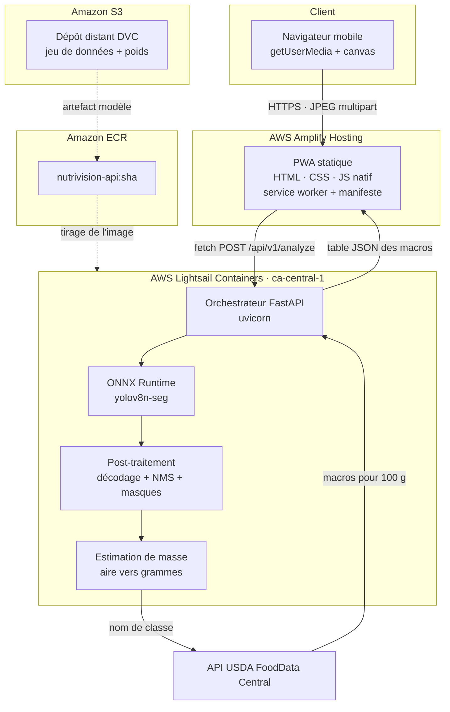
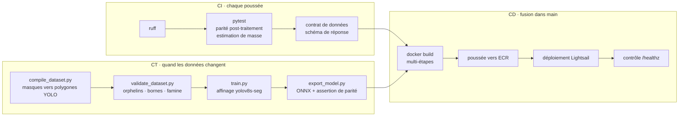
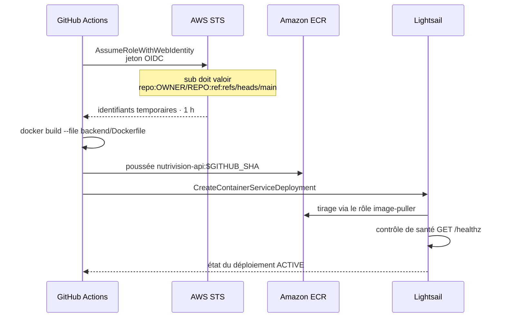
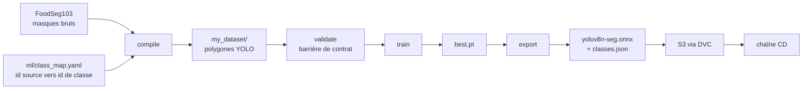
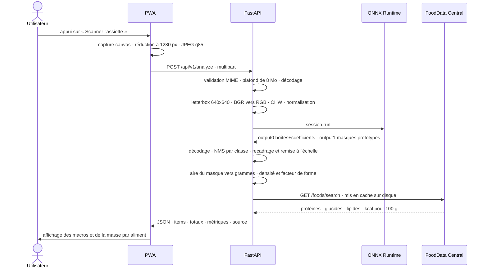

# NutriVision

**[English](README.md) · [Français](README.fr.md)**

Pointez la caméra d'un téléphone vers une assiette. Obtenez protéines, glucides, lipides et calories.

Une application web progressive adossée à un modèle de segmentation YOLOv8 servi par ONNX Runtime, déployée sur AWS via une chaîne GitHub Actions sans aucune clé d'accès permanente.

| | |
|---|---|
| **Démo en ligne** | `https://main.d2dz9pix11gtly.amplifyapp.com` |
| **Santé de l'API** | `https://<service>.ca-central-1.cs.amazonlightsail.com/healthz` |
| **Région** | `ca-central-1` — Montréal |
| **Cours** | A61 · Collège Bois de Boulogne |
| **Auteurs** | Ismail Boufaress · Mohamed El Amine Kraiem · Cédric Ribassin |

---

## 1. Pourquoi le CI/CD ne suffit pas à un système d'IA

Le CI/CD classique repose sur une hypothèse unique : **l'artefact est une fonction pure du code.** Même commit, même binaire. Tester le code revient à tester l'artefact.

Cette hypothèse tombe en apprentissage automatique. L'artefact déployé dépend de trois entrées :

```
modèle = f(code, données, hyperparamètres)
```

Une chaîne qui ne versionne que la première des trois est incapable de reproduire sa propre sortie. C'est la raison d'être du troisième pilier de la démarche MLOps — **le CT, ou entraînement continu** — aux côtés du CI et du CD.

| Pilier | Question à laquelle il répond | Déclencheur | Artefact produit |
|---|---|---|---|
| **CI** — Intégration continue | Le code est-il correct et les données respectent-elles leur contrat ? | chaque poussée, chaque demande de tirage | rapport de tests |
| **CD** — Livraison continue | Ce commit précis peut-il atteindre la production sans risque ? | fusion dans `main` | image conteneur, service déployé |
| **CT** — Entraînement continu | Le modèle tient-il encore lorsque les données changent ? | nouvelles données, changement de schéma, dérive | poids du modèle, graphe ONNX |

Le cadrage suit les travaux SE4AI de Carnegie Mellon : un système d'IA dépourvu de chaîne reproductible n'est pas seulement non testé, il constitue une dette technique qui s'accumule à chaque réentraînement.

---

## 2. Architecture du système



Chaque saut est en HTTPS. L'API caméra refuse de s'exécuter hors contexte sécurisé : le TLS est donc une exigence fonctionnelle et non une mesure de durcissement. Amplify et Lightsail terminent tous deux le TLS sur des domaines appartenant à AWS, ce qui évite l'achat et la validation d'un certificat.

---

## 3. Les trois chaînes



### CI — ce qui s'exécute à chaque poussée

`.github/workflows/ci.yml`

- **Analyse statique** — `ruff check app tests`
- **Oracle de correction** — `tests/test_postprocess.py` construit un tenseur de sortie YOLO synthétique comportant deux boîtes superposées de même classe et une boîte distincte, puis vérifie que le NMS supprime exactement le doublon. C'est l'implémentation de référence avec laquelle tout noyau accéléré doit concorder.
- **Contrat de données** — `tests/test_contract.py` gèle le schéma de réponse JSON. La PWA se lie à `items[].macros.protein` et consorts ; si une refonte du backend renomme un champ, la compilation échoue avant que le frontal n'affiche silencieusement `—`.
- **Intégrité du service worker** — un script vérifie que chaque chemin préchargé dans `sw.js` existe réellement dans `frontend/`. Une entrée manquante fait échouer `addAll()` et l'application ne s'installe plus.

### CD — ce qui s'exécute à la fusion dans `main`

`.github/workflows/deploy-lightsail.yml`



**Aucune clé d'accès AWS n'existe dans ce dépôt ni dans les secrets GitHub.** L'authentification passe par OpenID Connect : GitHub émet un jeton d'identité de courte durée, AWS STS l'échange contre des identifiants valides une heure, et la politique de confiance restreint cet échange à un seul dépôt et une seule branche.

```json
"token.actions.githubusercontent.com:sub":
  "repo:Zen-Daitsu/Nutrivision:ref:refs/heads/main"
```

Le frontal se déploie indépendamment. Amplify surveille `main`, lit `amplify.yml`, injecte le point d'entrée de l'API dans `frontend/js/config.js` au moment de la compilation, et applique les en-têtes de cache — un an pour les ressources versionnées par empreinte, `no-cache` pour `index.html`, `sw.js` et `config.js`, afin qu'une PWA installée ne puisse jamais exécuter le paquet de la semaine dernière contre l'API de cette semaine.

### CT — ce qui s'exécute quand les données changent

`dvc.yaml` décrit la chaîne d'entraînement sous forme de graphe acyclique orienté. `dvc repro` ne réexécute que les étapes dont les dépendances ont changé.



Quatre propriétés rendent cette chaîne reproductible et pas seulement automatisée :

**Partition déterministe.** La première implémentation répartissait les images avec `hash()` de Python, dont la graine varie d'un processus à l'autre. Chaque réexécution rebrassait entraînement et validation, provoquant une fuite de données entre versions DVC. La partition dérive désormais de `sha1(nom_de_base)`, stable entre processus, machines et compilations de Python.

**Correspondance de classes explicite.** FoodSeg103 comporte 104 catégories. `ml/class_map.yaml` fait correspondre un sous-ensemble choisi aux identifiants de classe du projet ; les identifiants source non répertoriés sont écartés plutôt que fusionnés en silence.

**Une barrière de contrat qui échoue bruyamment.** `validate_dataset.py` retourne un code non nul en cas d'images ou d'étiquettes orphelines, d'identifiants de classe hors bornes, de coordonnées non normalisées, de polygones malformés, ou de famine de classe sous cinquante instances. Une classe affamée produit un modèle qui se trompe avec assurance.

**Une barrière de validation du modèle.** `export_model.py` exécute le graphe PyTorch et le graphe ONNX exporté sur le même tenseur et vérifie que l'écart absolu maximal reste sous `1e-3`. Un export qui se charge n'est pas un export qui est correct.

---

## 4. Cycle de vie d'une requête



### Contrat de réponse

```json
{
  "items": [{
    "class_id": 0, "name": "broccoli", "confidence": 0.91,
    "box_xyxy": [212.0, 145.0, 640.0, 512.0], "mask_area_px": 148230,
    "mass_g": 162.4, "mass_confidence": "low",
    "macros": {"protein": 5.7, "carbs": 11.4, "fat": 0.6, "calories": 55.2},
    "fdc_id": 170379
  }],
  "totals": {"protein": 5.7, "carbs": 11.4, "fat": 0.6, "calories": 55.2},
  "inference_ms": 412.7, "postprocess_ms": 18.3, "source": "numpy",
  "scale_px_per_mm": 4.0
}
```

---

## 5. Structure du dépôt

```
nutrivision/
├── .github/workflows/
│   ├── ci.yml                  analyse · tests unitaires · contrat de données
│   ├── deploy-lightsail.yml    build · poussée ECR · bascule du conteneur
│   └── build-mojo.yml          sonde de compilation du noyau Mojo
├── frontend/
│   ├── index.html              viseur + affichage des macros
│   ├── css/styles.css
│   ├── js/camera.js            cycle de vie getUserMedia · capture d'image
│   ├── js/api.js               fetch multipart · délai · réessai
│   ├── js/app.js               machine à états · rendu
│   ├── js/config.js            point d'entrée API · écrit au déploiement
│   ├── manifest.json           PWA installable
│   └── sw.js                   préchargement du shell · /api jamais mis en cache
├── backend/
│   ├── app/
│   │   ├── main.py             FastAPI · CORS · réception multipart
│   │   ├── config.py           configuration pilotée par l'environnement
│   │   ├── schemas.py          contrat de réponse figé
│   │   ├── inference.py        session ORT · letterbox · aiguillage
│   │   ├── postprocess.py      décodage et NMS NumPy · oracle de correction
│   │   ├── mojo_bridge.py      interface ctypes vers le noyau Mojo
│   │   ├── mass.py             aire segmentée vers grammes
│   │   └── nutrition.py        client USDA · cache disque · repli hors ligne
│   ├── mojo/postprocess.mojo   décodage et NMS SIMD · export ABI C
│   ├── tests/                  parité · contrat · masse
│   ├── Dockerfile              multi-étapes · export ONNX puis runtime allégé
│   └── pixi.toml               chaîne d'outils MAX épinglée
├── ml/
│   ├── class_map.yaml          id FoodSeg103 vers id de classe projet
│   ├── compile_dataset.py      masques vers polygones · partition déterministe
│   ├── validate_dataset.py     barrière de contrat en CI
│   ├── train.py                affinage
│   └── export_model.py         export ONNX + assertion de parité
├── infra/                      Terraform · S3 · CloudFront · ECR · IAM OIDC
├── amplify.yml                 spécification de build et en-têtes de cache
└── dvc.yaml                    compile · validate · train · export
```

---

## 6. État actuel

Bilan honnête, car une chaîne qui promet plus qu'elle ne livre vaut moins qu'une chaîne qui promet moins.

| Composant | État | Remarque |
|---|---|---|
| PWA sur Amplify | **Déployée** | caméra, capture, envoi et affichage fonctionnels |
| FastAPI sur Lightsail | **Déployé** | `/healthz` retourne `status: ok` |
| Chaîne ECR + OIDC | **Opérationnelle** | aucun identifiant statique |
| Tests CI | **Au vert** | parité du post-traitement, contrat, masse |
| Modèle d'inférence | **COCO d'origine** | `yolov8n-seg` : pizza, brocoli, banane, pomme, sandwich, orange, carotte, hot-dog, beignet, gâteau |
| Modèle alimentaire dédié | **En attente** | nécessite la réexécution de la chaîne CT décrite ci-dessous |
| Noyau Mojo | **Bloqué** | voir §7 |
| Terraform dans `infra/` | **Spécifié, non provisionné** | décrit l'architecture ECS cible ; le prototype en service repose sur Lightsail |

### Limites connues

**La masse est modélisée, non mesurée.** Une image monoculaire ne porte aucune information de profondeur. L'estimateur applique une heuristique de solide mince, `h_eff = k · sqrt(A)`, avec facteurs de forme et densités par classe. L'erreur avoisine ±25 à 40 % avec une carte de référence dans le cadre, et davantage sans. Chaque valeur nutritionnelle hérite de cette erreur, raison pour laquelle la réponse expose `mass_confidence` sous la forme `high`, `medium` ou `low` selon la source d'échelle employée.

**Le jeu de données de la phase 1 doit être recompilé.** L'artefact actuellement versionné dans S3 a été produit par une implémentation qui fixait l'identifiant de classe à `0` et partitionnait avec `hash()`. Toutes les étiquettes de cet artefact appartiennent à une seule classe. Le `ml/compile_dataset.py` corrigé figure dans ce dépôt ; la chaîne CT n'a pas encore été réexécutée avec.

---

## 7. Accélération Mojo — état

Le dépôt contient `backend/mojo/postprocess.mojo`, un noyau qui remplace la boucle de décodage et de suppression des non-maxima par une implémentation SIMD exportée en ABI C et chargée via `ctypes`.

Il n'est **pas actif en production.** `NV_MOJO_ENABLED=0`, et l'API rapporte `"source": "numpy"`.

Mojo 1.0 est paru le 11 août 2026 dans le cadre de Modular 26.5 et a introduit des ruptures que le noyau précède : `fn` a été supprimé au profit de `def`, `alias` renommé en `comptime`, les imports implicites de la bibliothèque standard sont devenus une erreur, `@export` exige désormais un effet `abi("C")` explicite, et `UnsafePointer` est déprécié au profit de `Pointer` assorti d'un paramètre d'origine explicite. La migration est en cours dans `build-mojo.yml`.

**Sur l'affirmation de performance.** ONNX Runtime confie déjà le graphe convolutif à des noyaux C++ optimisés. Mojo n'accélère que le post-traitement — quelques millisecondes sur une requête de plusieurs centaines. Le chiffre à publier est l'écart mesuré de `postprocess_ms` entre `source: "mojo"` et `source: "numpy"` sur une image identique, et non un banc d'essai constructeur comparant une boucle de Mandelbrot scalaire à du CPython pur.

---

## 8. Mise en œuvre

### Prérequis

- Un compte AWS avec accès à la console, région `ca-central-1`
- Une clé d'API USDA FoodData Central — https://fdc.nal.usda.gov/api-key-signup
- Docker et Python 3.12 pour le travail local ; WSL2 ou Linux pour la chaîne d'outils Mojo

### Configuration AWS initiale

```
IAM  → Fournisseurs d'identité → OpenID Connect
       URL       https://token.actions.githubusercontent.com
       Audience  sts.amazonaws.com

IAM  → Rôles → Identité web → nutrivision-gha-deploy
       confiance  repo:Zen-Daitsu/Nutrivision:ref:refs/heads/main
       politique  ecr:GetAuthorizationToken · poussée ECR · déploiement Lightsail

ECR  → Créer un dépôt privé → nutrivision-api

Lightsail → Conteneurs → Small · échelle 1 · nutrivision-api
            Onglet Images → Ajouter un dépôt → nutrivision-api
```

Secrets du dépôt GitHub :

| Nom | Valeur |
|---|---|
| `AWS_DEPLOY_ROLE_ARN` | `arn:aws:iam::<ID_DE_COMPTE>:role/nutrivision-gha-deploy` |
| `USDA_API_KEY` | votre clé FoodData Central |

Variables du dépôt GitHub :

| Nom | Valeur |
|---|---|
| `LIGHTSAIL_SERVICE` | `nutrivision-api` |
| `FRONTEND_ORIGIN` | votre URL Amplify, sans barre oblique finale |

### Développement local

```bash
cd backend
pip install -r requirements-dev.txt
pytest -q                     # oracle de correction + contrats
uvicorn app.main:app --reload --port 8000

cd ../frontend
python3 -m http.server 5173   # getUserMedia exige localhost ou HTTPS
```

Pour tester sur téléphone, exposez le frontal par un tunnel : une adresse IP locale ne constitue pas un contexte sécurisé et la caméra refusera de s'ouvrir.

### Réexécution de la chaîne d'entraînement

```bash
dvc pull                                   # récupérer FoodSeg103 depuis S3
# corriger d'abord ml/class_map.yaml d'après category_id.txt de FoodSeg103
dvc repro compile validate                 # échoue bruyamment sur violation de contrat
python ml/train.py --data my_dataset/data.yaml --epochs 120   # T4 ou g4dn
python ml/export_model.py --weights runs/nutrivision/weights/best.pt
dvc push
```

---

## 9. Coûts

Les services de conteneurs Lightsail sont facturés à l'heure, sans mise en pause possible. Supprimez le service entre deux séances de travail et recréez-le depuis la même image ECR en trois minutes environ.

| Ressource | Ordre de grandeur |
|---|---|
| Lightsail Small, échelle 1 | 15 USD / mois · 0,021 USD / heure |
| Amplify Hosting | couvert par le palier gratuit à ce trafic |
| Stockage ECR | négligeable |
| S3 · dépôt distant DVC | proportionnel à la taille du jeu de données |

---

## 10. Licence et attribution

Ultralytics YOLOv8 est distribué sous AGPL-3.0. Dans un cadre scolaire, cela ne pose pas de difficulté. Toute distribution ou exploitation hébergée hors de l'établissement déclenche l'article 13 de l'AGPL, qui impose de proposer aux utilisateurs le code source correspondant complet, ou d'acquérir une licence commerciale auprès d'Ultralytics.

Les données nutritionnelles proviennent de l'API USDA FoodData Central. FoodSeg103 est utilisé selon les conditions publiées pour la recherche.
