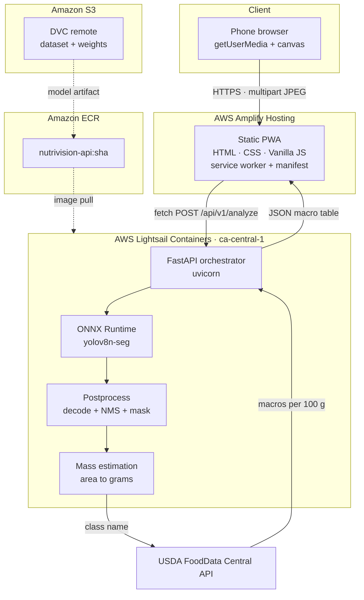
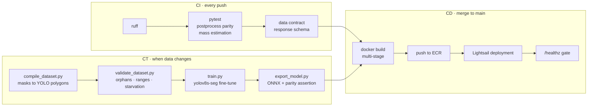
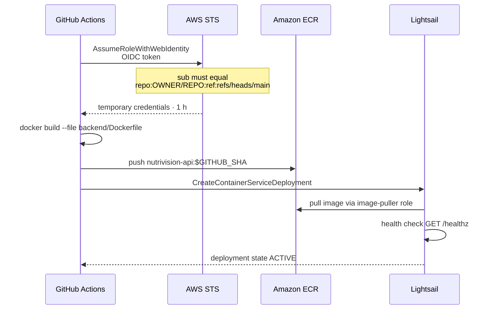
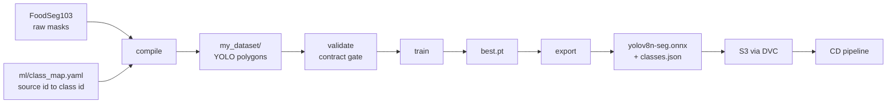
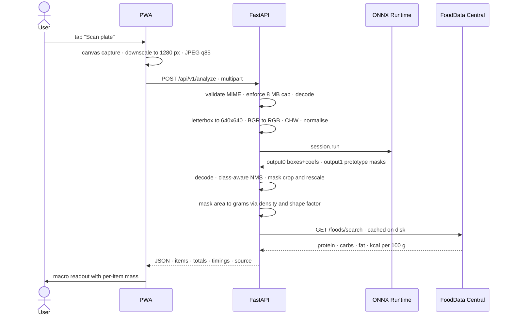

# NutriVision

**[English](README.md) · [Français](Readme.fr.md)**

Point a phone camera at a plate. Get protein, carbohydrates, fat and calories.

A Progressive Web App backed by a YOLOv8 segmentation model served over ONNX Runtime, deployed on AWS through a GitHub Actions pipeline with no long-lived credentials.

| | |
| **Live demo** | `https://main.d2dz9pix11gtly.amplifyapp.com` |
| **API health** | `https://<service>.ca-central-1.cs.amazonlightsail.com/healthz` |
| **Region** | `ca-central-1` — Montréal |
| **Course** | A61 · Collège Bois de Boulogne |
| **Authors** | Ismail Boufaress · Mohamed El Amine Kraiem · Cédric Ribassin |

---

## 1. Why CI/CD is not enough for an ML system

Classical CI/CD rests on one assumption: **the artifact is a pure function of the code.** Same commit, same binary. Test the code, and you have tested the artifact.

That assumption breaks in machine learning. The deployed artifact is a function of three inputs:

```
model = f(code, data, hyperparameters)
```

A pipeline that versions only the first of the three cannot reproduce its own output. This is why MLOps adds a third leg — **CT, Continuous Training** — alongside CI and CD.

| Leg | Question it answers | Trigger | Artifact produced |
|---|---|---|---|
| **CI** — Continuous Integration | Is the code correct and does the data satisfy its contract? | every push, every pull request | test report |
| **CD** — Continuous Delivery | Can this exact commit reach production safely? | merge to `main` | container image, deployed service |
| **CT** — Continuous Training | Does the model still hold when the data changes? | new data, schema change, drift | model weights, ONNX graph |

The framing follows the SE4AI body of work from Carnegie Mellon: an AI system without a reproducible pipeline is not merely untested — it is technical debt that compounds with every retraining run.

---

## 2. System architecture



Every hop is HTTPS. The camera API refuses to run outside a secure context, so TLS is a functional requirement rather than a hardening step. Amplify and Lightsail both terminate TLS on AWS-owned domains, which removes the need to purchase and validate a certificate.

---

## 3. The three pipelines



### CI — what runs on every push

`.github/workflows/ci.yml`

- **Lint** — `ruff check app tests`
- **Correctness oracle** — `tests/test_postprocess.py` builds a synthetic YOLO output tensor with two overlapping boxes of the same class and one distinct box, then asserts NMS suppresses exactly the duplicate. This is the reference implementation against which any accelerated kernel must agree.
- **Data contract** — `tests/test_contract.py` freezes the JSON response schema. The PWA binds to `items[].macros.protein` and friends; if a backend refactor renames a field, the build fails before the frontend silently displays `—`.
- **Service worker integrity** — a script checks that every path precached in `sw.js` actually exists in `frontend/`. A missing entry makes `addAll()` reject and the app fails to install.

### CD — what runs on merge to `main`

`.github/workflows/deploy-lightsail.yml`



**No AWS access key exists anywhere in this repository or in GitHub secrets.** Authentication uses OpenID Connect: GitHub issues a short-lived identity token, AWS STS exchanges it for credentials valid for one hour, and the trust policy restricts the exchange to a single repository and a single branch.

```json
"token.actions.githubusercontent.com:sub":
  "repo:Zen-Daitsu/Nutrivision:ref:refs/heads/main"
```

The frontend deploys independently. Amplify watches `main`, reads `amplify.yml`, injects the API endpoint into `frontend/js/config.js` at build time, and applies cache headers — one year for hashed assets, `no-cache` for `index.html`, `sw.js` and `config.js`, so an installed PWA can never run last week's bundle against this week's API.

### CT — what runs when the data changes

`dvc.yaml` defines the training pipeline as a directed acyclic graph. `dvc repro` re-executes only the stages whose dependencies changed.



Four properties make this reproducible rather than merely automated:

**Deterministic splits.** The first implementation routed images with Python's `hash()`, which is salted per process. Every rerun reshuffled train and validation, leaking data across DVC versions. The split now derives from `sha1(basename)`, stable across processes, machines and Python builds.

**Explicit class mapping.** FoodSeg103 ships 104 categories. `ml/class_map.yaml` maps a chosen subset to project class ids; unmapped source ids are dropped rather than silently collapsed.

**A contract gate that fails loudly.** `validate_dataset.py` returns non-zero on image/label orphans, out-of-range class ids, denormalised coordinates, malformed polygons, and class starvation below fifty instances. A starved class trains a model that is confidently wrong.

**A model validation gate.** `export_model.py` runs the PyTorch graph and the exported ONNX graph on the same tensor and asserts a maximum absolute difference below `1e-3`. An export that loads is not an export that is correct.

---

## 4. Request lifecycle



### Response contract

```json
{
  "items": [{
    "class_id": 0, "name": "broccoli", "confidence": 0.91,
    "box_xyxy": [212.0, 145.0, 640.0, 512.0], "mask_area_px": 148230,
    "mass_g": 162.4, "mass_confidence": "low",
    "macros": {"protein": 5.7, "carbs": 11.4, "fat": 0.6, "calories": 55.2},
    "fdc_id": 170379
  }],
  "totals": {"protein": 5.7, "carbs": 11.4, "fat": 0.6, "calories": 55.2},
  "inference_ms": 412.7, "postprocess_ms": 18.3, "source": "numpy",
  "scale_px_per_mm": 4.0
}
```

---

## 5. Repository layout

```
nutrivision/
├── .github/workflows/
│   ├── ci.yml                  lint · unit tests · data contract
│   ├── deploy-lightsail.yml    build · push to ECR · roll container
│   └── build-mojo.yml          Mojo kernel compilation probe
├── frontend/
│   ├── index.html              viewfinder + macro readout
│   ├── css/styles.css
│   ├── js/camera.js            getUserMedia lifecycle · frame capture
│   ├── js/api.js               multipart fetch · timeout · retry
│   ├── js/app.js               state machine · rendering
│   ├── js/config.js            API endpoint · written at deploy time
│   ├── manifest.json           installable PWA
│   └── sw.js                   shell precache · /api never cached
├── backend/
│   ├── app/
│   │   ├── main.py             FastAPI · CORS · multipart intake
│   │   ├── config.py           environment-driven settings
│   │   ├── schemas.py          frozen response contract
│   │   ├── inference.py        ORT session · letterbox · dispatch
│   │   ├── postprocess.py      NumPy decode and NMS · correctness oracle
│   │   ├── mojo_bridge.py      ctypes FFI to the Mojo kernel
│   │   ├── mass.py             segmented area to grams
│   │   └── nutrition.py        USDA client · disk cache · offline fallback
│   ├── mojo/postprocess.mojo   SIMD decode and NMS · C ABI export
│   ├── tests/                  parity · contract · mass
│   ├── Dockerfile              multi-stage · ONNX export then slim runtime
│   └── pixi.toml               pinned MAX toolchain
├── ml/
│   ├── class_map.yaml          FoodSeg103 id to project class id
│   ├── compile_dataset.py      masks to YOLO polygons · deterministic split
│   ├── validate_dataset.py     CI data contract gate
│   ├── train.py                fine-tuning
│   └── export_model.py         ONNX export + parity assertion
├── infra/                      Terraform · S3 · CloudFront · ECR · IAM OIDC
├── amplify.yml                 frontend build spec + cache headers
└── dvc.yaml                    compile · validate · train · export
```

---

## 6. Current state

Honest accounting, because a pipeline that claims more than it does is worse than one that claims less.

| Component | State | Note |
|---|---|---|
| PWA on Amplify | **Deployed** | camera, capture, upload, readout all functional |
| FastAPI on Lightsail | **Deployed** | `/healthz` returns `status: ok` |
| ECR + OIDC pipeline | **Operational** | no static credentials anywhere |
| CI tests | **Passing** | postprocess parity, contract, mass |
| Inference model | **Stock COCO** | `yolov8n-seg`, recognises pizza, broccoli, banana, apple, sandwich, orange, carrot, hot dog, donut, cake |
| Custom food model | **Pending** | requires the CT pipeline rerun described below |
| Mojo kernel | **Blocked** | see §7 |
| Terraform in `infra/` | **Specified, not provisioned** | describes the target ECS architecture; the running prototype uses Lightsail |

### Known limitations

**Mass is modelled, not measured.** A monocular image carries no depth. The estimator applies a thin-solid heuristic, `h_eff = k · sqrt(A)`, with per-class shape factors and densities. Error is roughly ±25–40 % with a fiducial reference card in frame, and worse without one. Every macro value inherits that error, which is why the response reports `mass_confidence` as `high`, `medium` or `low` according to the scale source used.

**The Phase 1 dataset requires recompilation.** The dataset currently versioned in S3 was produced by an implementation that hardcoded the class id to `0` and split on `hash()`. Every label in that artifact belongs to a single class. The corrected `ml/compile_dataset.py` is in this repository; the CT pipeline has not yet been rerun against it.

---

## 7. Mojo acceleration — status

The repository contains `backend/mojo/postprocess.mojo`, a kernel that replaces the decode and non-maximum-suppression loop with a SIMD implementation exported over the C ABI and loaded through `ctypes`.

It is **not active in production.** `NV_MOJO_ENABLED=0`, and the API reports `"source": "numpy"`.

Mojo 1.0 was released on 11 August 2026 as part of Modular 26.5 and introduced breaking changes that the kernel predates: `fn` was removed in favour of `def`, `alias` was renamed to `comptime`, implicit standard-library imports became an error, `@export` now requires an explicit `abi("C")` effect, and `UnsafePointer` was deprecated in favour of `Pointer` with an explicit origin parameter. Migration is in progress in `build-mojo.yml`.

**On the performance claim.** ONNX Runtime already dispatches the convolutional graph to tuned C++ kernels. Mojo accelerates postprocessing only — a few milliseconds of a several-hundred-millisecond request. The figure worth reporting is the measured delta in `postprocess_ms` between `source: "mojo"` and `source: "numpy"` on an identical frame, not a vendor benchmark comparing a scalar Mandelbrot loop against pure CPython.

---

## 8. Running it

### Prerequisites

- AWS account with the console, region `ca-central-1`
- A USDA FoodData Central API key — https://fdc.nal.usda.gov/api-key-signup
- Docker and Python 3.12 for local work; WSL2 or Linux for the Mojo toolchain

### One-time AWS setup

```
IAM  → Identity providers → OpenID Connect
       URL      https://token.actions.githubusercontent.com
       Audience sts.amazonaws.com

IAM  → Roles → Web identity → nutrivision-gha-deploy
       trust  repo:Zen-Daitsu/Nutrivision:ref:refs/heads/main
       policy ecr:GetAuthorizationToken · ecr push · lightsail deploy

ECR  → Create private repository → nutrivision-api

Lightsail → Containers → Small · scale 1 · nutrivision-api
            Images tab → Add repository → nutrivision-api
```

GitHub repository secrets:

| Name | Value |
|---|---|
| `AWS_DEPLOY_ROLE_ARN` | `arn:aws:iam::<ACCOUNT_ID>:role/nutrivision-gha-deploy` |
| `USDA_API_KEY` | your FoodData Central key |

GitHub repository variables:

| Name | Value |
|---|---|
| `LIGHTSAIL_SERVICE` | `nutrivision-api` |
| `FRONTEND_ORIGIN` | your Amplify URL, no trailing slash |

### Local development

```bash
cd backend
pip install -r requirements-dev.txt
pytest -q                     # correctness oracle + contracts
uvicorn app.main:app --reload --port 8000

cd ../frontend
python3 -m http.server 5173   # getUserMedia requires localhost or HTTPS
```

To test on a phone, tunnel the frontend — a LAN IP is not a secure context and the camera will refuse to open.

### Rerunning the training pipeline

```bash
dvc pull                                   # fetch FoodSeg103 from S3
# correct ml/class_map.yaml against FoodSeg103 category_id.txt first
dvc repro compile validate                 # fails loudly on contract violations
python ml/train.py --data my_dataset/data.yaml --epochs 120   # T4 or g4dn
python ml/export_model.py --weights runs/nutrivision/weights/best.pt
dvc push
```

---

## 9. Cost

Lightsail container services bill hourly with no pause. Delete the service between working sessions and recreate it from the same ECR image in about three minutes.

| Resource | Approximate |
|---|---|
| Lightsail Small, scale 1 | USD 15 / month · USD 0.021 / hour |
| Amplify Hosting | covered by free tier at this traffic |
| ECR storage | negligible |
| S3 · DVC remote | proportional to dataset size |

---

## 10. Licence and attribution

Ultralytics YOLOv8 is distributed under AGPL-3.0. For coursework this is unproblematic. Any distribution or hosted operation outside the institution triggers AGPL §13, which obliges offering the complete corresponding source to users, or obtaining a commercial licence from Ultralytics.

Nutritional data is retrieved from the USDA FoodData Central API. FoodSeg103 is used under its published research terms.
