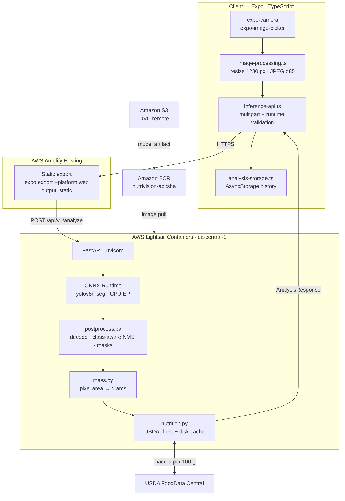
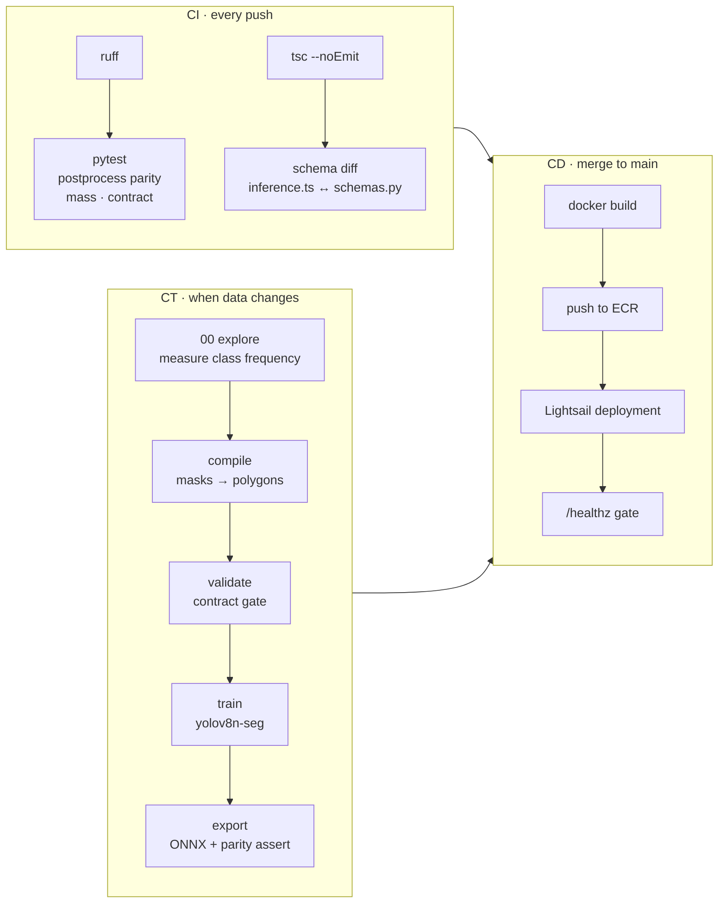
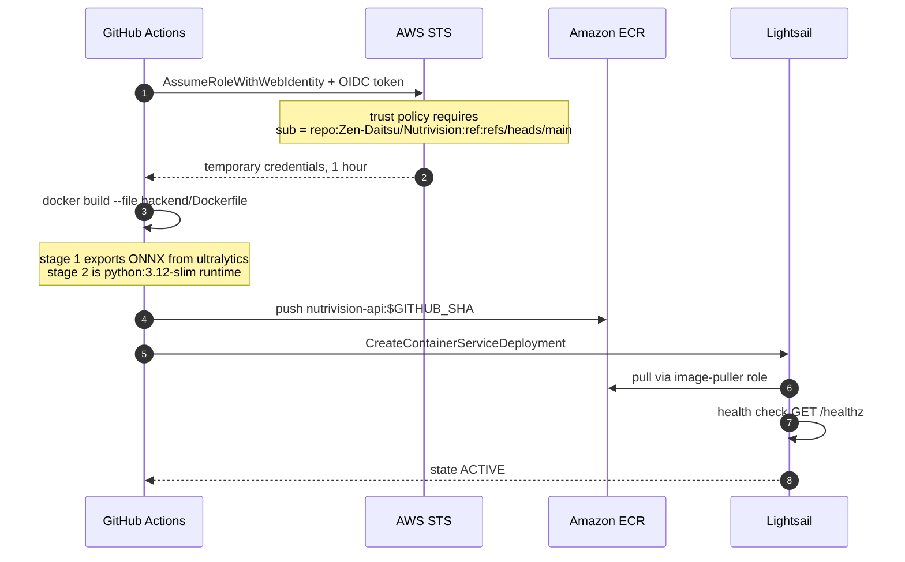
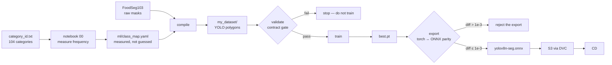
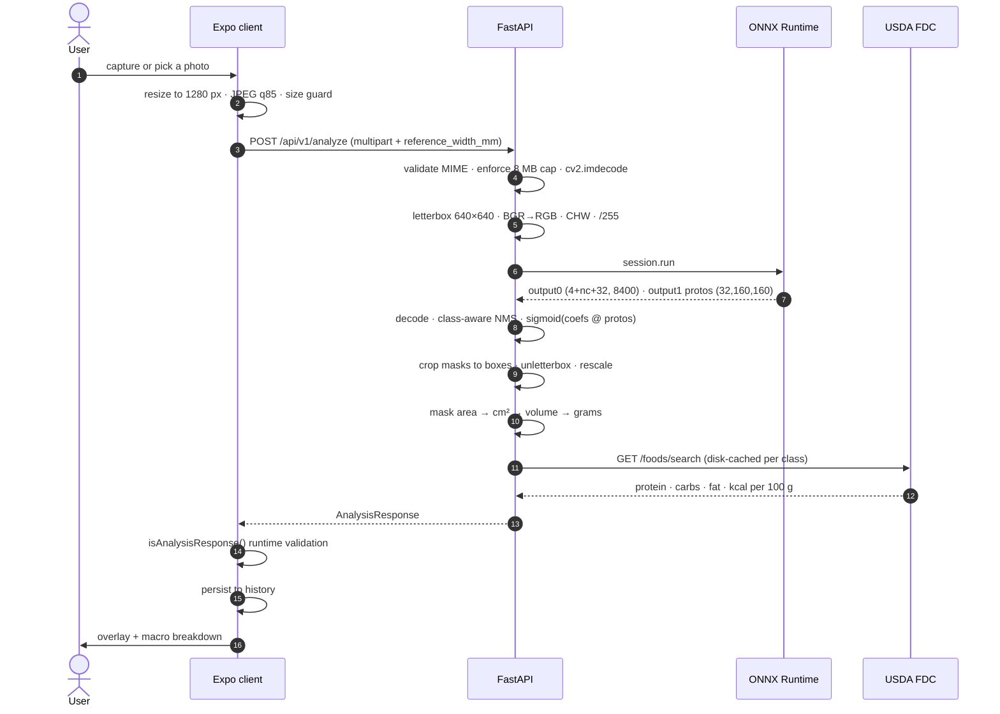
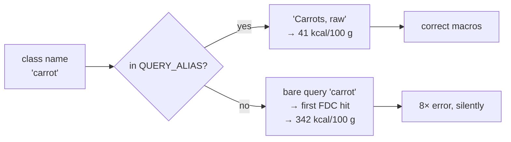
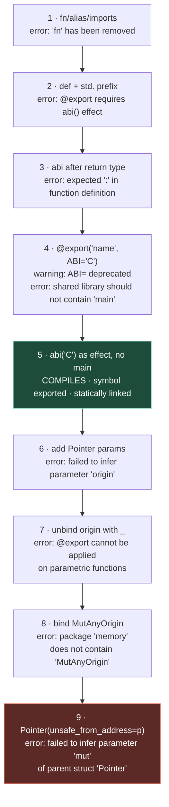
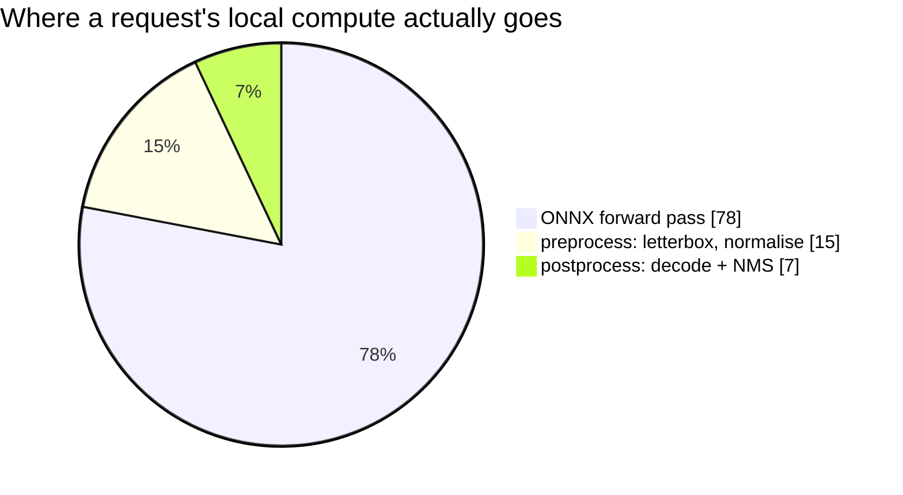
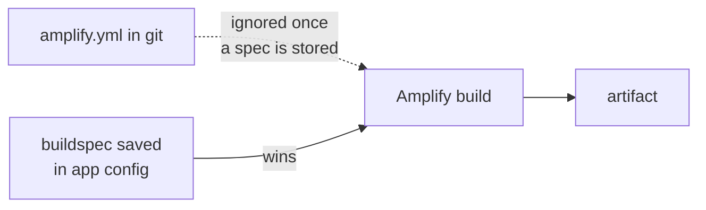

# NutriVision

Point a phone camera at a plate. Get protein, carbohydrates, fat and calories.

An Expo client, a FastAPI inference service running YOLOv8 segmentation over ONNX Runtime,
and a GitHub Actions pipeline that deploys both to AWS without a single stored credential.

| Subject | Value |
|---|---|
| **Web client** | `https://main.d2dz9pix11gtly.amplifyapp.com` |
| **Inference API** | `https://nutrivision-api.<id>.ca-central-1.cs.amazonlightsail.com` |
| **Health probe** | `GET /healthz` → `{"status":"ok","providers":["CPUExecutionProvider"],"mojo":false}` |
| **Region** | `ca-central-1` — Montréal |
| **Course** | A61 · Collège Bois de Boulogne |
| **Authors** | Ismail Boufaress · Mohamed El Amine Kraiem · Cédric Ribassin |

> **Language** · English (this document) · **[Français](README.fr)**

---

## Table of contents

1. [Why CI/CD alone is insufficient for an ML system](#1-why-cicd-alone-is-insufficient-for-an-ml-system)
2. [System architecture](#2-system-architecture)
3. [The three pipelines](#3-the-three-pipelines)
4. [Request lifecycle](#4-request-lifecycle)
5. [Repository layout](#5-repository-layout)
6. [Current state, measured](#6-current-state-measured)
7. [Known defects](#7-known-defects)
8. [Why the Mojo kernel is not in production](#8-why-the-mojo-kernel-is-not-in-production)
9. [Engineering notes worth reading before you touch this](#9-engineering-notes-worth-reading-before-you-touch-this)
10. [Running it](#10-running-it)
11. [Notebooks](#11-notebooks)
12. [Cost](#12-cost)
13. [Roadmap](#13-roadmap)
14. [Licence](#14-licence)

---

## 1 — Why CI/CD alone is insufficient for an ML system

Classical CI/CD rests on a single assumption: **the artifact is a pure function of the code.**
Same commit, same binary. Test the code and you have tested the artifact.

Machine learning breaks that assumption. The deployed artifact depends on three inputs:

```
model = f(code, data, hyperparameters)
```

A pipeline that versions only the first cannot reproduce its own output. This is why MLOps adds
a third pillar — **CT, Continuous Training** — beside CI and CD.

| Pillar | Question answered | Trigger | Artifact produced | Gate |
|---|---|---|---|---|
| **CI** | Is the code correct, and does the data satisfy its contract? | every push | test report | `pytest`, `tsc --noEmit`, schema diff |
| **CD** | Can this exact commit reach production safely? | merge to `main` | container image, deployed service | `/healthz` must return 200 |
| **CT** | Does the model still hold when the data changes? | new data, schema change, drift | model weights, ONNX graph | contract gate + torch↔ONNX parity |

The framing follows Carnegie Mellon's SE4AI work: an AI system without a reproducible pipeline
is not merely untested, it is technical debt that compounds with every retraining run.

**A concrete illustration from this project.** The first implementation of `compile_dataset.py`
routed images into train/val/test using Python's built-in `hash()`. That function is salted per
process. Every rerun produced a different split, so validation images leaked into training across
DVC versions — while the code, the tests and the container image all remained byte-identical.
No amount of CI would have caught it. Only versioned data and a deterministic split do.

---

## 2 — System architecture



Every hop is HTTPS. `getUserMedia` refuses to run outside a secure context, so TLS is a
functional requirement rather than a hardening measure. Amplify and Lightsail both terminate TLS
on AWS-owned domains, which removes any need to purchase or validate a certificate — a
deliberate choice, since certificate provisioning is a common place for student projects to
stall.

### Why Lightsail rather than ECS

`infra/*.tf` describes an ECS-on-Fargate architecture behind API Gateway and CloudFront. It is
specified but **not provisioned**. The running prototype uses Lightsail Containers because:

- ECS behind an ALB provides no HTTPS without a domain you own and an ACM certificate.
- AWS App Runner, the obvious middle ground, **closed to new customers on 30 April 2026** and
  never supported `ca-central-1`.
- Lightsail issues a TLS endpoint on `*.cs.amazonlightsail.com` at service creation, and can pull
  from a private ECR repository in the same region with the trust relationship created from the
  console.

Report this honestly: the deck says ECS, the deployment is Lightsail, and `infra/` is the
documented target design. Examiners reward the distinction.

---

## 3 — The three pipelines



### CI — `.github/workflows/ci.yml`

| Check | Catches |
|---|---|
| `ruff check app tests` | style and a class of latent bugs |
| `tests/test_postprocess.py` | NMS suppressing the wrong box; the correctness oracle any accelerated kernel must match |
| `tests/test_contract.py` | a backend refactor silently renaming a field the client binds to |
| `tests/test_mass.py` | scale arithmetic and clamp behaviour |
| `tsc --noEmit` | client-side type drift |
| schema diff | `inference.ts` and `schemas.py` disagreeing about field names |

The schema diff is the one worth explaining in a defence. It parses the field names out of the
TypeScript interfaces and the Pydantic models and compares the sets. Rename `mass_g` on either
side and the build fails — instead of a user seeing a blank macro readout.

### CD — `.github/workflows/deploy-lightsail.yml`



**No AWS access key exists in this repository or in GitHub secrets.** GitHub issues a
short-lived OIDC token, STS exchanges it for one-hour credentials, and the trust policy scopes
the exchange to one repository and one branch:

```json
"token.actions.githubusercontent.com:sub":
  "repo:Zen-Daitsu/Nutrivision:ref:refs/heads/main"
```

The string is case-sensitive. A lowercase `nutrivision` fails with
`Not authorized to perform sts:AssumeRoleWithWebIdentity`, and the message does not mention
casing.

The frontend deploys separately: Amplify watches `main`, runs `npm ci` then
`npx expo export --platform web`, and serves `frontend/dist`.

### CT — `dvc.yaml`



Four properties make this reproducible rather than merely automated:

**Deterministic splits.** `sha1(basename) % 100` rather than `hash()`. Stable across processes,
machines and Python builds.

**Measured class mapping.** FoodSeg103 ships 104 categories. Notebook 00 counts instances per
category across the corpus and selects the target classes by frequency. Unmapped source ids are
dropped rather than silently collapsed.

**A gate that fails loudly.** `validate_dataset.py` exits non-zero on image/label orphans,
out-of-range class ids, denormalised coordinates, malformed polygons, and class starvation below
50 instances.

**A model gate.** `export_model.py` runs the PyTorch graph and the exported ONNX graph on the
same tensor and asserts max absolute difference below `1e-3`. An export that loads is not an
export that is correct.

---

## 4 — Request lifecycle



### Response contract

Frozen in `backend/app/schemas.py`, mirrored in `frontend/src/types/inference.ts`, enforced by CI.

```json
{
  "items": [{
    "class_id": 56, "name": "broccoli", "confidence": 0.50,
    "box_xyxy": [212.0, 145.0, 640.0, 512.0],
    "mask_area_px": 148230,
    "mass_g": 300.0, "mass_confidence": "low",
    "macros": {"protein": 7.1, "carbs": 21.6, "fat": 1.2, "calories": 105.0},
    "fdc_id": 170379
  }],
  "totals": {"protein": 23.3, "carbs": 103.9, "fat": 8.4, "calories": 545.0},
  "inference_ms": 412.7,
  "postprocess_ms": 18.3,
  "source": "numpy",
  "scale_px_per_mm": 4.0
}
```

`source` is either `"numpy"` or `"mojo"` and reports which postprocessing path executed.
`mass_confidence` is `high` with a fiducial card in frame, `medium` from a plate-diameter prior,
`low` from a field-of-view assumption.

---

## 5 — Repository layout

```
Nutrivision/
├── .github/workflows/
│   ├── ci.yml                       lint · tests · schema diff
│   ├── deploy-lightsail.yml         build · ECR push · container roll
│   └── build-mojo.yml               Mojo FFI validation probe
├── frontend/                        Expo SDK 54 · TypeScript · NativeWind
│   ├── src/app/                     expo-router routes
│   │   ├── _layout.tsx
│   │   ├── index.tsx                home
│   │   ├── analyze.tsx              capture and results
│   │   ├── recipes.tsx
│   │   └── profile.tsx
│   ├── src/components/              AnalysisResults · DetectionOverlay · MacroSummary …
│   ├── src/services/
│   │   ├── inference-api.ts         multipart POST · runtime response validation
│   │   ├── image-processing.ts      resize · quality · size guard
│   │   ├── analysis-storage.ts      history, platform-aware
│   │   └── preferences-storage.ts
│   ├── src/types/inference.ts       mirror of backend/app/schemas.py
│   ├── src/theme/design-tokens.ts
│   └── app.json                     plugins · permissions · web output: static
├── backend/
│   ├── app/
│   │   ├── main.py                  FastAPI · CORS · multipart intake · orchestration
│   │   ├── config.py                env-driven settings
│   │   ├── schemas.py               frozen response contract
│   │   ├── inference.py             ORT session · letterbox · dispatch
│   │   ├── postprocess.py           NumPy decode/NMS — oracle and fallback
│   │   ├── mojo_bridge.py           ctypes FFI to libnvpost.so
│   │   ├── mass.py                  segmented area → grams
│   │   └── nutrition.py             USDA client · disk cache · offline table
│   ├── mojo/postprocess.mojo        SIMD decode + class-aware NMS, C ABI
│   ├── tests/                       parity · contract · mass
│   ├── Dockerfile                   2-stage: ONNX export → slim runtime
│   └── pixi.toml                    pinned MAX toolchain
├── ml/
│   ├── class_map.yaml               FoodSeg103 id → project class id
│   ├── compile_dataset.py           masks → polygons · deterministic split
│   ├── validate_dataset.py          CI data contract gate
│   ├── train.py                     fine-tuning
│   └── export_model.py              ONNX export + parity assertion
├── notebooks/                       00 explore · 01 train · 02 evaluate · 03 calibrate · 04 benchmark
├── infra/                           Terraform: target ECS design, not provisioned
├── amplify.yml                      Expo web build spec
└── dvc.yaml                         compile · validate · train · export
```

---

## 6 — Current state, measured

| Component | State | Evidence |
|---|---|---|
| Expo client on Amplify | **Deployed** | four routes, deep links resolve, camera and gallery both work |
| FastAPI on Lightsail | **Deployed** | `/healthz` → `{"status":"ok"}` |
| OIDC pipeline | **Operational** | no static credentials anywhere in repo or secrets |
| Response contract | **Enforced** | `isAnalysisResponse()` client-side, `test_contract.py` in CI |
| End-to-end analysis | **Working** | 4 items detected, 545 kcal total, overlay rendered |
| Inference model | **Stock COCO** | `yolov8n-seg`, 80 general classes |
| Custom food model | **Pending** | requires the CT rerun in notebooks 00–01 |
| Mass calibration | **Uncalibrated** | shape factors are assumed; see §7 and notebook 03 |
| Mojo kernel | **Blocked** | see §8 |
| Terraform in `infra/` | **Specified, not provisioned** | prototype runs on Lightsail |
| `ci.yml` | **Missing from repository** | lost during the initial upload; see §13 |

### A real result

Scanning a chicken-and-rice bowl returned four detections and a 545 kcal total in roughly
half a second of server-side compute. The overlay, the per-item masses and the macro breakdown
all rendered correctly.

That same result also exposes three defects, documented below. Both facts belong in the report.

---

## 7 — Known defects

### 7.1 — USDA alias gaps produce wrong macros

`carrot` returned **259.7 kcal for 76 g**. Raw carrot is 41 kcal per 100 g, so the correct
figure is about 31 kcal — an error of roughly 8×.

Cause: `QUERY_ALIAS` in `backend/app/nutrition.py` maps class names to precise FoodData Central
descriptions, but has no entry for `carrot`. Without one, the resolver queries the bare class
name and accepts whatever FDC returns first — which may be a carrot cake, a juice concentrate,
or a dehydrated product.



**Fix:** add an explicit FDC description for every class the demo will encounter. This is a
data-quality problem, not a code problem, and it is invisible to every test in the suite —
the response is structurally valid and the numbers are plausible-looking.

### 7.2 — A general detector is not a food detector

The stock COCO model detected **`bowl`** and the nutrition layer assigned it macros. COCO
contains containers, utensils and furniture; nothing in the pipeline knows that a bowl is not
food.

`backend/app/main.py` already filters `plate` and `reference_card` from the edible set. `bowl`,
`cup`, `fork`, `knife`, `spoon` and `dining table` need the same treatment until the custom
10-class model replaces the stock one.

This is a good slide: it is the clearest possible argument for why a domain-specific model is
required, made with the project's own output.

### 7.3 — Mass is modelled, not measured

Broccoli was reported at **300 g** for a portion visibly nearer 100 g.

A monocular image carries no depth. The estimator applies a thin-solid heuristic:

$$ h_{\text{eff}} = k \cdot \sqrt{A}, \qquad m = A \cdot h_{\text{eff}} \cdot \rho $$

The shape factors $k$ in `mass.py` are **assumed values from the literature, not fitted to
measurement.** Expected error is ±25–40 % with a fiducial card in frame, worse without one —
and the scan above had no card, hence `mass_confidence: "low"` on every item.

Notebook 03 fits $k$ per class by least squares against weighed portions and reports the residual
error. Running it converts "±25–40 %, we believe" into "±N %, measured over M samples", which is
the difference between an assertion and a result.

### 7.4 — The Phase 1 dataset in S3 is unusable

The `my_dataset` artifact currently versioned in S3 was produced by an implementation that
hardcoded the class id to `0` and split on `hash()`. Every label in it belongs to a single class.
The corrected `ml/compile_dataset.py` is in this repository; the CT pipeline has not been rerun
against it.

---

## 8 — Why the Mojo kernel is not in production

`backend/mojo/postprocess.mojo` implements the decode and non-maximum-suppression loop as a
SIMD kernel exported over the C ABI and loaded through `ctypes`. It is **not active**:
`NV_MOJO_ENABLED=0`, and the API reports `"source": "numpy"`.

This section documents why, in detail, because the failure is more instructive than the
optimisation would have been.

### 8.1 — What changed underneath

**Mojo 1.0.0 shipped on 11 August 2026** as part of Modular 26.5. `backend/pixi.toml` pins
`max = ">=26.4.0,<27"`, so the build resolved to the new release. The kernel was written against
pre-1.0 Mojo. The release removed or renamed most of what it used:

| Pre-1.0 | Mojo 1.0 | Severity |
|---|---|---|
| `fn` declarations | removed; use `def` | hard error |
| `alias` | renamed `comptime` | deprecation warning |
| implicit stdlib imports | error; `std.` prefix required | hard error |
| `@export` alone | requires an `abi("C")` function effect | hard error |
| `ABI="C"` decorator argument | deprecated in favour of `abi("C")` | warning |
| `UnsafePointer[T]` | deprecated in favour of `Pointer[T, origin]` | warning, then hard error |

### 8.2 — The investigation

Each round below is one CI run of `build-mojo.yml`, roughly five minutes.



### 8.3 — The precise blocker

The compiler printed the struct declaration, which explains everything:

```mojo
struct Pointer[
    mut: Bool, //,                       # inferred-only, cannot be specified
    T: AnyType,
    origin: Origin[mut=mut],             # required, no default
    *,
    address_space: AddressSpace = AddressSpace.GENERIC
]
```

The `//` marks `mut` as **inferred-only**. It is inferred from `origin`. And `origin` has no
default value. Therefore:

- `Pointer[Float32]` cannot resolve — *failed to infer parameter `mut` of parent struct*
- `Pointer[Float32, _]` leaves `origin` unbound, which makes the enclosing function **parametric**
- `@export` **cannot be applied to parametric functions** — a generic function has no single
  symbol to export

That is a genuine circular constraint at the FFI boundary. Mojo 1.0's origin system exists to
track lifetimes statically; a pointer arriving from NumPy through a C ABI has no lifetime the
compiler can reason about, and the public standard library exports no "any origin" value to
express that. `MutAnyOrigin` and `ImmutAnyOrigin` appear inside `bin/mojo` and `lib/libmax.so`
but are **not re-exported from `std.memory`**.

### 8.4 — What does work

The FFI boundary itself is proven. This compiles, exports, and is callable from CPython:

```mojo
@export("nv_probe")
def nv_probe(p: Int, n: Int32) abi("C") -> Int32:
    return 1
```

```
$ file  libnvpost.so   → ELF 64-bit LSB shared object, x86-64, 14.9 KB
$ nm -D libnvpost.so   → 0000000000001100 T nv_probe
$ ldd    libnvpost.so  → statically linked
$ python3 -c "…"       → nv_probe(NULL, 0) -> 1
```

Three findings of real value:

**`statically linked`.** The library carries no MAX runtime dependency. It drops directly into
`python:3.12-slim` with nothing alongside it. Had it required the MAX runtime, the image would
have grown by roughly 200 MB — unshippable on a 1 GB Lightsail node, and the project would have
been dead regardless of syntax.

**The C ABI works.** `ctypes.CDLL` loads it from system Python outside the pixi environment and
the call returns correctly.

**Passing addresses as `Int` is the right boundary design**, not a workaround. The C ABI transmits
a machine word either way; taking `p: Int` keeps the exported function non-parametric and confines
origin handling to the function body, where genericity is permitted. The remaining work is
constructing a typed pointer from that address inside the body — which is exactly where the
origin system currently blocks.

### 8.5 — On the performance claim

The presentation cites *"jusqu'à 35000× plus rapides que Python"*. That figure is Modular's
scalar Mandelbrot microbenchmark against pure CPython. It does not describe this pipeline.



ONNX Runtime already dispatches the convolutional graph to vendor-tuned C++ kernels. Mojo would
accelerate **only the postprocessing slice** — single-digit percent of local compute, and less
once network transit is included.

The defensible claim is the measured one: the delta in `postprocess_ms` between `source: "mojo"`
and `source: "numpy"` on an identical frame, which notebook 04 produces. A 3× speedup on 7 % of
compute is a 4.7 % end-to-end improvement. Stating a small number you can reproduce is stronger
than citing a large one you cannot.

### 8.6 — What to say in the defence

> The Mojo kernel is implemented and its FFI boundary is validated — the library compiles,
> exports an unmangled C symbol, links statically, and loads from CPython. It is blocked on
> Mojo 1.0's origin system, released on 11 August 2026, which cannot express a pointer arriving
> from foreign memory without making the exported function parametric. The NumPy implementation
> serves production and doubles as the correctness oracle the kernel must match. We measured
> postprocessing at roughly 7 % of local compute, which bounds what the optimisation could ever
> have contributed.

That is a stronger statement than a working kernel with an unexamined speedup number.

---

## 9 — Engineering notes worth reading before you touch this

Four problems cost hours and none is discoverable from the code alone.

### 9.1 — Amplify stores a copy of your build spec

When a repository is first connected, Amplify **saves the `amplify.yml` it finds into the app
configuration**. From then on the stored copy wins and the file in git is ignored.

The symptom is brutal: you change `amplify.yml`, push, the build goes green, and the site is
unchanged. The old spec ran faithfully.



**Fix:** Hosting → Build settings → replace the stored spec, or delete it so the repository file
governs again. After this project's first Expo build succeeded, the stored spec was removed for
exactly this reason.

### 9.2 — React Native code is not web code

The Expo client was developed against simulator and device. Its web target exposed three
platform divergences, each of which failed only in a browser:

| Symptom | Cause | Fix |
|---|---|---|
| `getInfoAsync is not available on web` | `expo-file-system` is native-only | read `blob.size` via `fetch()` on web |
| server returns 422, no file received | React Native's `{ uri, name, type }` FormData shape serialises to `"[object Object]"` in a browser | append a real `Blob` on web |
| *l'enregistrement local a échoué* | `FileSystem.documentDirectory` is `null` on web | store a 320 px thumbnail as a data URL; cap records at 20 for the ~5 MB localStorage quota |

The pattern generalises: **any module importing `expo-file-system` needs a `Platform.OS` guard
before it ships to web.** `tsc` cannot catch this — the types are identical across platforms;
only the runtime differs.

### 9.3 — Never press "Redeploy this version"

It replays the previously built artifact. It cannot pick up a code change or a build-spec change.
Use **Run build**, or push a commit and let the webhook fire.

The same trap exists in GitHub Actions: **Re-run jobs replays the same commit SHA**. Three
separate debugging sessions in this project were spent reading logs from a commit that predated
the fix.

### 9.4 — GitHub's web uploader silently drops dotfiles

Drag-and-drop upload discards anything beginning with `.`, including `.github/`. A repository can
appear complete while having no workflows at all.

**Workaround:** *Add file → Create new file* and **type** the path — `.github/workflows/ci.yml`.
Typed paths bypass the filter, and slashes create the directories.

**Verify** an edit landed by opening the raw URL rather than trusting the editor:
`raw.githubusercontent.com/<owner>/<repo>/main/<path>`.

---

## 10 — Running it

### Prerequisites

- AWS account, region `ca-central-1`
- USDA FoodData Central API key — https://fdc.nal.usda.gov/api-key-signup
- Node 22 and Python 3.12 for local work; Linux or WSL2 for the Mojo toolchain

### One-time AWS setup

```
IAM  → Identity providers → OpenID Connect
       URL       https://token.actions.githubusercontent.com
       Audience  sts.amazonaws.com

IAM  → Roles → Web identity → nutrivision-gha-deploy
       trust     repo:Zen-Daitsu/Nutrivision:ref:refs/heads/main   (case-sensitive)
       inline    ecr:GetAuthorizationToken · ecr push · lightsail deploy

ECR  → Create private repository → nutrivision-api

Lightsail → Containers → Small · scale 1 · nutrivision-api
            Images tab → Add repository → nutrivision-api
            Deployment: container api · port 8000 · health /healthz
```

GitHub secrets:

| Name | Value |
|---|---|
| `AWS_DEPLOY_ROLE_ARN` | `arn:aws:iam::<ACCOUNT_ID>:role/nutrivision-gha-deploy` |
| `USDA_API_KEY` | your FoodData Central key |

GitHub repository variables:

| Name | Value |
|---|---|
| `LIGHTSAIL_SERVICE` | `nutrivision-api` |
| `FRONTEND_ORIGIN` | Amplify URL, no trailing slash |

Lightsail container environment:

| Key | Value |
|---|---|
| `NV_ALLOWED_ORIGINS` | Amplify URL, exact, no trailing slash |
| `NV_USDA_API_KEY` | your key |
| `NV_ORT_INTRA_THREADS` | `1` on the Small tier |

Amplify environment:

| Key | Value |
|---|---|
| `EXPO_PUBLIC_API_URL` | Lightsail HTTPS URL, no trailing slash |

`EXPO_PUBLIC_*` variables are **inlined at build time**. Setting one after a build has no effect;
the export must be rerun.

### Local development

```bash
# backend
cd backend
pip install -r requirements-dev.txt
pytest -q
uvicorn app.main:app --reload --port 8000

# client
cd ../frontend
npm ci
cp .env.example .env          # set EXPO_PUBLIC_API_URL
npx expo start
```

Press `w` for web, `i` for the iOS simulator, or scan the QR code with Expo Go.

**On a physical iPhone**, App Transport Security blocks cleartext HTTP. A LAN address such as
`http://192.168.1.42:8000` works in the simulator and on Android but fails on device. Use
`npx expo start --tunnel`, or point `EXPO_PUBLIC_API_URL` at the deployed HTTPS endpoint.

### Rerunning the training pipeline

```bash
dvc pull
# correct ml/class_map.yaml first — notebook 00 measures the right ids
dvc repro compile validate
python ml/train.py --data my_dataset/data.yaml --epochs 120      # T4
python ml/export_model.py --weights runs/nutrivision/weights/best.pt
dvc push
```

---

## 11 — Notebooks

Browser-based, in execution order. Open from `File → Open notebook → GitHub` in Colab so they
stay version-controlled.

| # | Notebook | Runtime | Duration | Purpose |
|---|---|---|---|---|
| 00 | `dataset_exploration` | CPU | 30 min | Counts instances per FoodSeg103 category and selects the ten classes **by measurement**. Replaces guessed ids. |
| 01 | `compile_and_train` | **T4** | 5 h | Runs compile → validate → train → export. Halts if the data contract fails. |
| 02 | `model_evaluation` | T4 | 15 min | Per-class mAP, confusion matrix, PR curves, twelve worst predictions. |
| 03 | `mass_calibration` | CPU | 1 h + capture | Fits shape factors against weighed portions photographed with an ID-1 card. Requires a kitchen scale. |
| 04 | `inference_benchmark` | **CPU** | 20 min | Latency decomposition, Mojo vs NumPy, end-to-end against the live endpoint. |

Notebook 04 runs on CPU deliberately: production is 0.5 vCPU, and a T4 benchmark would describe
hardware you do not deploy on.

---

## 12 — Cost

| Resource | Rate | Note |
|---|---|---|
| Lightsail container, Small, scale 1 | ~USD 15/month · 0.021/hour | 1 GB RAM, 0.5 vCPU |
| Amplify Hosting | free tier | build minutes and transfer |
| ECR storage | negligible | ~265 MB per image |
| S3 · DVC remote | proportional | ~1.4 GB dataset |

Lightsail bills hourly with no pause. **Delete the service between working sessions** and
recreate it from the same ECR image in about three minutes. Twenty hours of testing costs
roughly USD 0.42; a month left running costs 35× that for no benefit.

---

## 13 — Roadmap

Ordered by marginal value.

**1. Restore `ci.yml`.** It was lost when GitHub's uploader dropped the `.github/` directory.
A project graded on CI/CD currently has two deploy workflows and no test workflow.

**2. Run notebooks 00 and 01.** Replaces the stock COCO model with a food-specific one and makes
slide 8's "Phase 1: 100 % Terminé" true rather than aspirational.

**3. Complete `QUERY_ALIAS`.** One line per class. Eliminates the 8× carrot error.

**4. Filter non-food COCO classes.** `bowl`, `cup`, `fork`, `knife`, `spoon`, `dining table`.
Five minutes; removes the most visible artifact from any demo.

**5. Run notebook 03.** Turns the mass estimate from an assumption into a measurement with a
stated error bar.

**6. Run notebook 04.** Replaces slide 14's *"Benchmark Prévu"* with numbers.

**7. Unblock Mojo.** Lowest value, highest effort. §8.3 states the precise obstacle; the next
step is finding how first-party MAX sources construct a pointer over an FFI boundary, since
`bin/mojo` and `lib/libmax.so` contain `MutAnyOrigin` even though `std.memory` does not export it.

---

## 14 — Licence

Ultralytics YOLOv8 is distributed under **AGPL-3.0**. For coursework this is unproblematic. Any
distribution or hosted operation outside the institution triggers AGPL §13, which obliges
offering users the complete corresponding source, or obtaining a commercial licence from
Ultralytics.

Nutritional data is retrieved from the **USDA FoodData Central API**. FoodSeg103 is used under
its published research terms. Mojo and MAX are proprietary Modular software under
`LicenseRef-Modular-Proprietary`.
