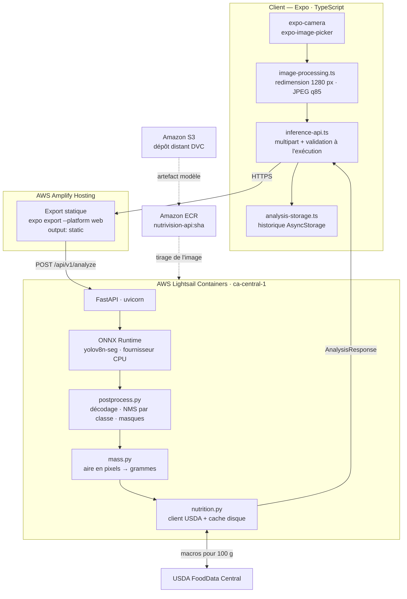
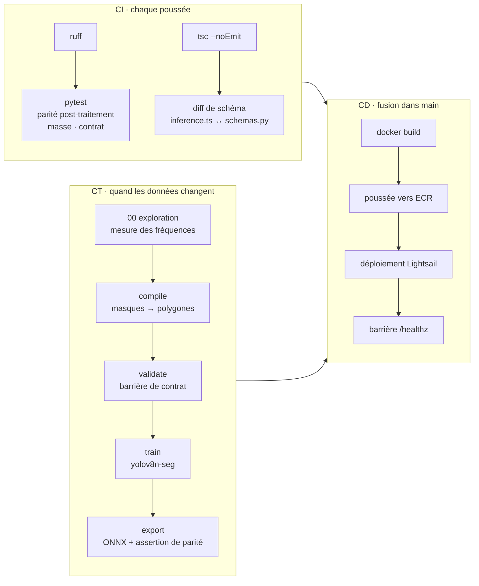
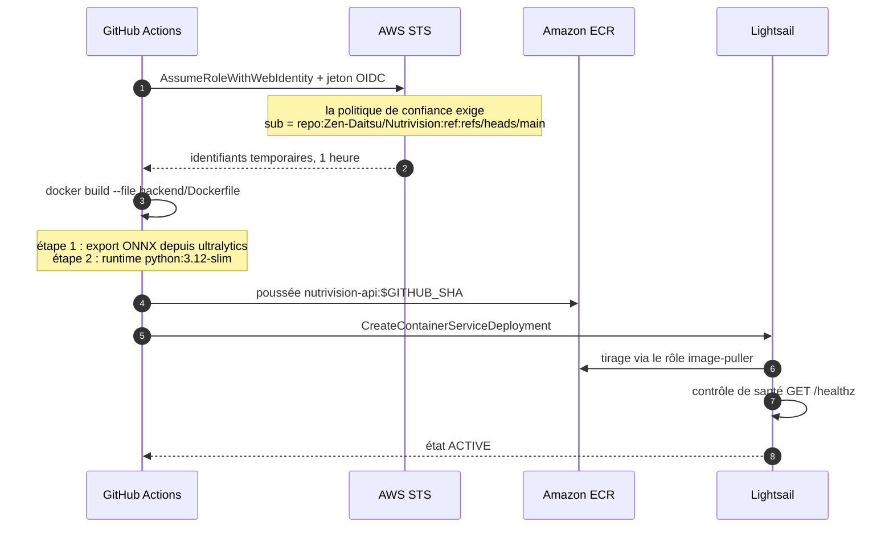
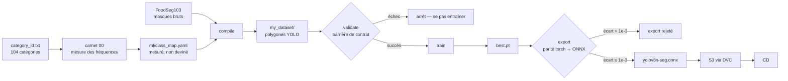
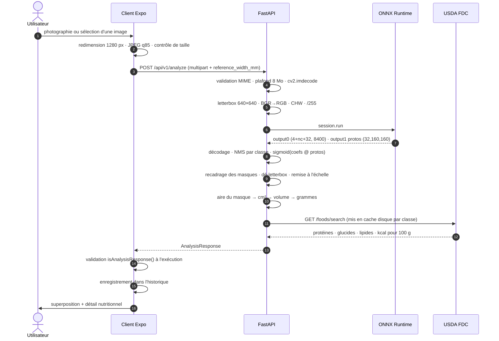
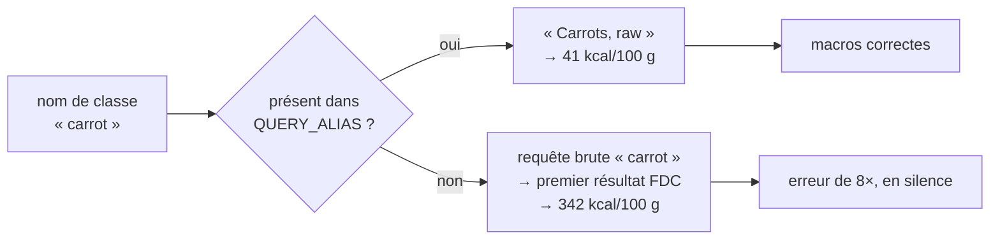
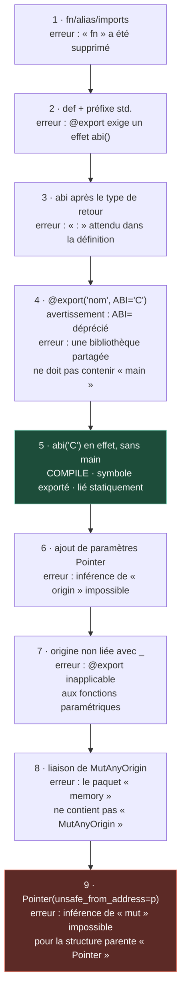
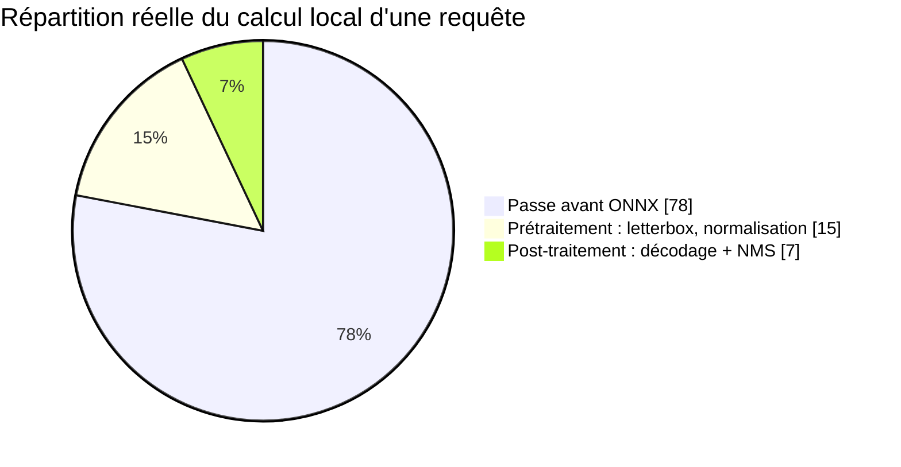
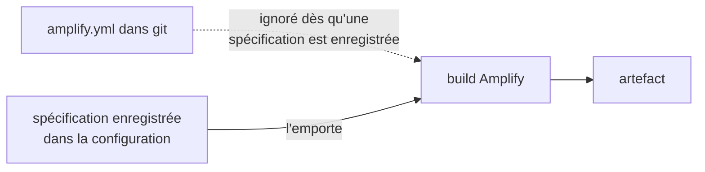

# NutriVision

Pointez la caméra d'un téléphone vers une assiette. Obtenez protéines, glucides, lipides et calories.

Un client Expo, un service d'inférence FastAPI exécutant une segmentation YOLOv8 sur ONNX Runtime,
et une chaîne GitHub Actions qui déploie les deux sur AWS sans aucun identifiant stocké.

| Sujet | Valeur |
|---|---|
| **Client web** | `https://main.d2dz9pix11gtly.amplifyapp.com` |
| **API d'inférence** | `https://nutrivision-api.<id>.ca-central-1.cs.amazonlightsail.com` |
| **Sonde de santé** | `GET /healthz` → `{"status":"ok","providers":["CPUExecutionProvider"],"mojo":false}` |
| **Région** | `ca-central-1` — Montréal |
| **Cours** | A61 · Collège Bois de Boulogne |
| **Auteurs** | Ismail Boufaress · Mohamed El Amine Kraiem · Cédric Ribassin |

> **Langue** · **[English](README.md)** · Français (ce document)

---

## Table des matières

1. [Pourquoi le CI/CD seul ne suffit pas à un système d'IA](#1--pourquoi-le-cicd-seul-ne-suffit-pas-à-un-système-dia)
2. [Architecture du système](#2--architecture-du-système)
3. [Les trois chaînes](#3--les-trois-chaînes)
4. [Cycle de vie d'une requête](#4--cycle-de-vie-dune-requête)
5. [Structure du dépôt](#5--structure-du-dépôt)
6. [État actuel, mesuré](#6--état-actuel-mesuré)
7. [Défauts connus](#7--défauts-connus)
8. [Pourquoi le noyau Mojo n'est pas en production](#8--pourquoi-le-noyau-mojo-nest-pas-en-production)
9. [Notes d'ingénierie à lire avant d'intervenir](#9--notes-dingénierie-à-lire-avant-dintervenir)
10. [Mise en œuvre](#10--mise-en-œuvre)
11. [Carnets Jupyter](#11--carnets-jupyter)
12. [Coûts](#12--coûts)
13. [Feuille de route](#13--feuille-de-route)
14. [Licences](#14--licences)

---

## 1 — Pourquoi le CI/CD seul ne suffit pas à un système d'IA

Le CI/CD classique repose sur une hypothèse unique : **l'artefact est une fonction pure du code.**
M�me commit, même binaire. Tester le code revient à tester l'artefact.

L'apprentissage automatique invalide cette hypothèse. L'artefact déployé dépend de trois entrées :

```
modèle = f(code, données, hyperparamètres)
```

Une chaîne qui ne versionne que la première est incapable de reproduire sa propre sortie. C'est la
raison d'être du troisième pilier de la démarche MLOps — **le CT, ou entraînement continu** — aux
côtés du CI et du CD.

| Pilier | Question posée | Déclencheur | Artefact produit | Barrière |
|---|---|---|---|---|
| **CI** | Le code est-il correct, et les données respectent-elles leur contrat ? | chaque poussée | rapport de tests | `pytest`, `tsc --noEmit`, diff de schéma |
| **CD** | Ce commit précis peut-il atteindre la production sans risque ? | fusion dans `main` | image conteneur, service déployé | `/healthz` doit répondre 200 |
| **CT** | Le modèle tient-il encore quand les données changent ? | nouvelles données, dérive | poids, graphe ONNX | barrière de contrat + parité torch↔ONNX |

Le cadrage suit les travaux SE4AI de Carnegie Mellon : un système d'IA dépourvu de chaîne
reproductible n'est pas seulement non testé, il constitue une dette technique qui s'accumule à
chaque réentraînement.

**Une illustration concrète tirée de ce projet.** La première version de `compile_dataset.py`
répartissait les images entre entraînement, validation et test avec la fonction native `hash()`.
Cette fonction utilise une graine différente à chaque processus. Chaque réexécution produisait donc
une partition différente, et des images de validation fuyaient vers l'entraînement d'une version
DVC à l'autre — alors que le code, les tests et l'image conteneur restaient identiques au bit près.
Aucune quantité de CI n'aurait détecté cela. Seuls des données versionnées et une partition
déterministe le peuvent.

---

## 2 — Architecture du système



Chaque saut est en HTTPS. `getUserMedia` refuse de s'exécuter hors contexte sécurisé : le TLS est
donc une exigence fonctionnelle et non une mesure de durcissement. Amplify et Lightsail terminent
tous deux le TLS sur des domaines appartenant à AWS, ce qui évite l'achat et la validation d'un
certificat — un choix délibéré, car le provisionnement de certificats est un point d'enlisement
fréquent pour un projet étudiant.

### Pourquoi Lightsail plutôt qu'ECS

Le répertoire `infra/*.tf` décrit une architecture ECS sur Fargate derrière API Gateway et
CloudFront. Elle est **spécifiée mais non provisionnée**. Le prototype en service repose sur
Lightsail Containers, pour trois raisons :

- ECS derrière un ALB ne fournit aucun HTTPS sans un domaine vous appartenant et un certificat ACM.
- AWS App Runner, l'intermédiaire évident, **a fermé aux nouveaux clients le 30 avril 2026** et
  n'a jamais desservi `ca-central-1`.
- Lightsail attribue un point d'entrée TLS sur `*.cs.amazonlightsail.com` dès la création du
  service, et sait tirer une image depuis un dépôt ECR privé de la même région, la relation de
  confiance étant créée depuis la console.

À signaler honnêtement dans le rapport : la présentation annonce ECS, le déploiement repose sur
Lightsail, et `infra/` documente l'architecture cible. Les correcteurs valorisent cette distinction.

---

## 3 — Les trois chaînes



### CI — `.github/workflows/ci.yml`

| Vérification | Ce qu'elle attrape |
|---|---|
| `ruff check app tests` | style et une classe de bogues latents |
| `tests/test_postprocess.py` | un NMS qui supprime la mauvaise boîte ; l'oracle de correction auquel tout noyau accéléré doit se conformer |
| `tests/test_contract.py` | une refonte du backend renommant en silence un champ auquel le client se lie |
| `tests/test_mass.py` | l'arithmétique d'échelle et le comportement du plafonnement |
| `tsc --noEmit` | la dérive de types côté client |
| diff de schéma | `inference.ts` et `schemas.py` en désaccord sur les noms de champs |

Le diff de schéma mérite d'être expliqué en soutenance. Il extrait les noms de champs des
interfaces TypeScript et des modèles Pydantic, puis compare les ensembles. Renommez `mass_g` d'un
côté et la compilation échoue — plutôt qu'un utilisateur voyant un affichage vide.

### CD — `.github/workflows/deploy-lightsail.yml`



**Aucune clé d'accès AWS n'existe dans ce dépôt ni dans les secrets GitHub.** GitHub émet un jeton
OIDC de courte durée, STS l'échange contre des identifiants valides une heure, et la politique de
confiance restreint cet échange à un seul dépôt et une seule branche :

```json
"token.actions.githubusercontent.com:sub":
  "repo:Zen-Daitsu/Nutrivision:ref:refs/heads/main"
```

La chaîne est sensible à la casse. Un `nutrivision` en minuscules échoue sur
`Not authorized to perform sts:AssumeRoleWithWebIdentity`, et le message ne mentionne pas la casse.

Le frontal se déploie séparément : Amplify surveille `main`, exécute `npm ci` puis
`npx expo export --platform web`, et sert `frontend/dist`.

### CT — `dvc.yaml`



Quatre propriétés rendent cette chaîne reproductible et pas seulement automatisée :

**Partition déterministe.** `sha1(nom_de_base) % 100` au lieu de `hash()`. Stable entre processus,
machines et compilations de Python.

**Correspondance de classes mesurée.** FoodSeg103 comporte 104 catégories. Le carnet 00 compte les
instances de chacune dans le corpus et sélectionne les classes cibles par fréquence. Les
identifiants source non répertoriés sont écartés plutôt que fusionnés en silence.

**Une barrière qui échoue bruyamment.** `validate_dataset.py` retourne un code non nul en cas
d'images ou d'étiquettes orphelines, d'identifiants hors bornes, de coordonnées non normalisées,
de polygones malformés, ou de famine de classe sous cinquante instances.

**Une barrière sur le modèle.** `export_model.py` exécute le graphe PyTorch et le graphe ONNX
exporté sur le même tenseur et vérifie que l'écart absolu maximal reste sous `1e-3`. Un export qui
se charge n'est pas un export qui est correct.

---

## 4 — Cycle de vie d'une requête



### Contrat de réponse

Figé dans `backend/app/schemas.py`, reflété dans `frontend/src/types/inference.ts`, imposé par la CI.

```json
{
  "items": [{
    "class_id": 56, "name": "broccoli", "confidence": 0.50,
    "box_xyxy": [212.0, 145.0, 640.0, 512.0],
    "mask_area_px": 148230,
    "mass_g": 300.0, "mass_confidence": "low",
    "macros": {"protein": 7.1, "carbs": 21.6, "fat": 1.2, "calories": 105.0},
    "fdc_id": 170379
  }],
  "totals": {"protein": 23.3, "carbs": 103.9, "fat": 8.4, "calories": 545.0},
  "inference_ms": 412.7,
  "postprocess_ms": 18.3,
  "source": "numpy",
  "scale_px_per_mm": 4.0
}
```

`source` vaut `"numpy"` ou `"mojo"` et indique quel chemin de post-traitement a été exécuté.
`mass_confidence` vaut `high` avec une carte étalon dans le cadre, `medium` à partir d'un a priori
sur le diamètre de l'assiette, `low` à partir d'une hypothèse de champ de vision.

---

## 5 — Structure du dépôt

```
Nutrivision/
├── .github/workflows/
│   ├── ci.yml                       analyse · tests · diff de schéma
│   ├── deploy-lightsail.yml         build · poussée ECR · bascule du conteneur
│   └── build-mojo.yml               sonde de validation FFI Mojo
├── frontend/                        Expo SDK 54 · TypeScript · NativeWind
│   ├── src/app/                     routes expo-router
│   │   ├── _layout.tsx
│   │   ├── index.tsx                accueil
│   │   ├── analyze.tsx              capture et résultats
│   │   ├── recipes.tsx
│   │   └── profile.tsx
│   ├── src/components/              AnalysisResults · DetectionOverlay · MacroSummary …
│   ├── src/services/
│   │   ├── inference-api.ts         POST multipart · validation de la réponse
│   │   ├── image-processing.ts      redimension · qualité · contrôle de taille
│   │   ├── analysis-storage.ts      historique, adapté à la plateforme
│   │   └── preferences-storage.ts
│   ├── src/types/inference.ts       reflet de backend/app/schemas.py
│   ├── src/theme/design-tokens.ts
│   └── app.json                     greffons · permissions · web output: static
├── backend/
│   ├── app/
│   │   ├── main.py                  FastAPI · CORS · réception multipart · orchestration
│   │   ├── config.py                configuration pilotée par l'environnement
│   │   ├── schemas.py               contrat de réponse figé
│   │   ├── inference.py             session ORT · letterbox · aiguillage
│   │   ├── postprocess.py           décodage/NMS NumPy — oracle et repli
│   │   ├── mojo_bridge.py           interface ctypes vers libnvpost.so
│   │   ├── mass.py                  aire segmentée → grammes
│   │   └── nutrition.py             client USDA · cache disque · table hors ligne
│   ├── mojo/postprocess.mojo        décodage + NMS SIMD, ABI C
│   ├── tests/                       parité · contrat · masse
│   ├── Dockerfile                   2 étapes : export ONNX → runtime allégé
│   └── pixi.toml                    chaîne d'outils MAX épinglée
├── ml/
│   ├── class_map.yaml               id FoodSeg103 → id de classe projet
│   ├── compile_dataset.py           masques → polygones · partition déterministe
│   ├── validate_dataset.py          barrière de contrat en CI
│   ├── train.py                     affinage
│   └── export_model.py              export ONNX + assertion de parité
├── notebooks/                       00 exploration · 01 entraînement · 02 évaluation · 03 calibration · 04 banc d'essai
├── infra/                           Terraform : architecture ECS cible, non provisionnée
├── amplify.yml                      spécification de build Expo web
└── dvc.yaml                         compile · validate · train · export
```

---

## 6 — État actuel, mesuré

| Composant | État | Preuve |
|---|---|---|
| Client Expo sur Amplify | **Déployé** | quatre routes, liens profonds résolus, caméra et galerie fonctionnelles |
| FastAPI sur Lightsail | **Déployé** | `/healthz` → `{"status":"ok"}` |
| Chaîne OIDC | **Opérationnelle** | aucun identifiant statique dans le dépôt ni les secrets |
| Contrat de réponse | **Imposé** | `isAnalysisResponse()` côté client, `test_contract.py` en CI |
| Analyse de bout en bout | **Fonctionnelle** | 4 aliments détectés, 545 kcal au total, superposition rendue |
| Modèle d'inférence | **COCO d'origine** | `yolov8n-seg`, 80 classes généralistes |
| Modèle alimentaire dédié | **En attente** | nécessite la réexécution CT des carnets 00–01 |
| Calibration de masse | **Non calibrée** | facteurs de forme supposés ; voir §7 et carnet 03 |
| Noyau Mojo | **Bloqué** | voir §8 |
| Terraform dans `infra/` | **Spécifié, non provisionné** | le prototype tourne sur Lightsail |
| `ci.yml` | **Absent du dépôt** | perdu lors du téléversement initial ; voir §13 |

### Un résultat réel

L'analyse d'un bol de poulet et riz a retourné quatre détections et un total de 545 kcal pour
environ une demi-seconde de calcul côté serveur. La superposition, les masses par aliment et le
détail nutritionnel se sont tous affichés correctement.

Ce même résultat expose également trois défauts, documentés ci-dessous. Les deux faits ont leur
place dans le rapport.

---

## 7 — Défauts connus

### 7.1 — Les alias USDA manquants produisent des macros fausses

`carrot` a retourné **259,7 kcal pour 76 g**. La carotte crue affiche 41 kcal pour 100 g : la
valeur correcte avoisine donc 31 kcal — une erreur d'environ 8×.

Cause : `QUERY_ALIAS` dans `backend/app/nutrition.py` associe les noms de classes à des
descriptions FoodData Central précises, mais ne comporte aucune entrée pour `carrot`. Faute
d'alias, le résolveur interroge le nom brut de la classe et accepte le premier résultat retourné
par FDC — qui peut être un gâteau à la carotte, un concentré de jus, ou un produit déshydraté.



**Correction :** ajouter une description FDC explicite pour chaque classe que la démonstration
rencontrera. C'est un problème de qualité de données et non de code, et il est invisible pour
toute la suite de tests : la réponse est structurellement valide et les nombres paraissent
plausibles.

### 7.2 — Un détecteur généraliste n'est pas un détecteur alimentaire

Le modèle COCO d'origine a détecté un **`bowl`** et la couche nutritionnelle lui a attribué des
macros. COCO contient des contenants, des couverts et du mobilier ; rien dans la chaîne ne sait
qu'un bol n'est pas un aliment.

`backend/app/main.py` filtre déjà `plate` et `reference_card` de l'ensemble comestible. Il faut
étendre ce traitement à `bowl`, `cup`, `fork`, `knife`, `spoon` et `dining table` jusqu'à ce que
le modèle à 10 classes remplace celui d'origine.

Excellente diapositive : c'est l'argument le plus clair possible en faveur d'un modèle spécialisé,
construit à partir de la sortie du projet lui-même.

### 7.3 — La masse est modélisée, non mesurée

Le brocoli a été rapporté à **300 g** pour une portion visiblement plus proche de 100 g.

Une image monoculaire ne porte aucune information de profondeur. L'estimateur applique une
heuristique de solide mince :

$$ h_{\text{eff}} = k \cdot \sqrt{A}, \qquad m = A \cdot h_{\text{eff}} \cdot \rho $$

Les facteurs de forme $k$ dans `mass.py` sont des **valeurs supposées issues de la littérature,
non ajustées sur des mesures.** L'erreur attendue avoisine ±25 à 40 % avec une carte étalon dans
le cadre, et davantage sans — et l'analyse ci-dessus n'en comportait aucune, d'où le
`mass_confidence: "low"` sur chaque aliment.

Le carnet 03 ajuste $k$ par classe au moindre carré contre des portions pesées et rapporte
l'erreur résiduelle. L'exécuter transforme « ±25 à 40 %, selon nous » en « ±N %, mesuré sur M
échantillons », soit la différence entre une affirmation et un résultat.

### 7.4 — Le jeu de données de la phase 1 dans S3 est inutilisable

L'artefact `my_dataset` actuellement versionné dans S3 a été produit par une implémentation qui
fixait l'identifiant de classe à `0` et partitionnait avec `hash()`. Toutes ses étiquettes
appartiennent à une seule classe. Le `ml/compile_dataset.py` corrigé figure dans ce dépôt ; la
chaîne CT n'a pas encore été réexécutée avec.

---

## 8 — Pourquoi le noyau Mojo n'est pas en production

`backend/mojo/postprocess.mojo` implémente la boucle de décodage et de suppression des non-maxima
sous forme de noyau SIMD exporté en ABI C et chargé par `ctypes`. Il n'est **pas actif** :
`NV_MOJO_ENABLED=0`, et l'API rapporte `"source": "numpy"`.

Cette section documente le pourquoi en détail, car l'échec est plus instructif que ne l'aurait été
l'optimisation.

### 8.1 — Ce qui a changé sous nos pieds

**Mojo 1.0.0 est paru le 11 août 2026** dans le cadre de Modular 26.5. Le fichier
`backend/pixi.toml` épingle `max = ">=26.4.0,<27"` : la compilation a donc résolu vers cette
nouvelle version. Le noyau avait été écrit pour un Mojo antérieur à la 1.0. La version a supprimé
ou renommé l'essentiel de ce qu'il utilisait :

| Avant 1.0 | Mojo 1.0 | Gravité |
|---|---|---|
| déclarations `fn` | supprimées ; utiliser `def` | erreur bloquante |
| `alias` | renommé `comptime` | avertissement de dépréciation |
| imports implicites de la stdlib | erreur ; préfixe `std.` requis | erreur bloquante |
| `@export` seul | exige un effet de fonction `abi("C")` | erreur bloquante |
| argument `ABI="C"` du décorateur | déprécié au profit de `abi("C")` | avertissement |
| `UnsafePointer[T]` | déprécié au profit de `Pointer[T, origin]` | avertissement, puis erreur |

### 8.2 — L'investigation

Chaque étape ci-dessous correspond à une exécution de `build-mojo.yml`, soit environ cinq minutes.



### 8.3 — Le blocage précis

Le compilateur a fini par afficher la déclaration de structure, qui explique tout :

```mojo
struct Pointer[
    mut: Bool, //,                       # inférable uniquement, non spécifiable
    T: AnyType,
    origin: Origin[mut=mut],             # requis, sans valeur par défaut
    *,
    address_space: AddressSpace = AddressSpace.GENERIC
]
```

Le `//` marque `mut` comme **inférable uniquement**. Il est inféré depuis `origin`. Et `origin`
n'a pas de valeur par défaut. Par conséquent :

- `Pointer[Float32]` ne peut être résolu — *inférence de `mut` impossible pour la structure parente*
- `Pointer[Float32, _]` laisse `origin` non lié, ce qui rend la fonction englobante **paramétrique**
- `@export` **ne peut s'appliquer à une fonction paramétrique** — une fonction générique n'a pas de
  symbole unique à exporter

Il s'agit d'une véritable contrainte circulaire à la frontière FFI. Le système d'origines de Mojo
1.0 existe pour suivre les durées de vie statiquement ; un pointeur provenant de NumPy à travers
une ABI C n'a aucune durée de vie que le compilateur puisse raisonner, et la bibliothèque standard
publique n'exporte aucune valeur « origine quelconque » pour l'exprimer. `MutAnyOrigin` et
`ImmutAnyOrigin` apparaissent dans `bin/mojo` et `lib/libmax.so` mais **ne sont pas réexportés
depuis `std.memory`**.

### 8.4 — Ce qui fonctionne effectivement

La frontière FFI elle-même est prouvée. Ceci compile, s'exporte, et s'appelle depuis CPython :

```mojo
@export("nv_probe")
def nv_probe(p: Int, n: Int32) abi("C") -> Int32:
    return 1
```

```
$ file  libnvpost.so   → ELF 64-bit LSB shared object, x86-64, 14,9 Ko
$ nm -D libnvpost.so   → 0000000000001100 T nv_probe
$ ldd    libnvpost.so  → statically linked
$ python3 -c "…"       → nv_probe(NULL, 0) -> 1
```

Trois constats de valeur réelle :

**`statically linked`.** La bibliothèque ne porte aucune dépendance au runtime MAX. Elle s'insère
directement dans `python:3.12-slim` sans rien d'autre. Si le runtime MAX avait été requis, l'image
aurait grossi d'environ 200 Mo — inexpédiable sur un nœud Lightsail de 1 Go, et le projet aurait
été condamné indépendamment de la syntaxe.

**L'ABI C fonctionne.** `ctypes.CDLL` charge la bibliothèque depuis le Python système, hors de
l'environnement pixi, et l'appel retourne correctement.

**Passer les adresses en `Int` est la bonne conception de frontière**, et non un contournement.
L'ABI C transmet un mot machine dans les deux cas ; prendre `p: Int` maintient la fonction exportée
non paramétrique et confine la gestion des origines au corps de la fonction, où la généricité est
permise. Le travail restant consiste à construire un pointeur typé depuis cette adresse à
l'intérieur du corps — précisément là où le système d'origines bloque actuellement.

### 8.5 — Sur l'affirmation de performance

La présentation cite « jusqu'à 35000× plus rapides que Python ». Ce chiffre provient du banc
d'essai Mandelbrot scalaire de Modular comparé à du CPython pur. Il ne décrit pas cette chaîne.



ONNX Runtime confie déjà le graphe convolutif à des noyaux C++ optimisés par le fournisseur. Mojo
n'accélérerait **que la tranche de post-traitement** — quelques pour cent du calcul local, et
moins encore une fois le transit réseau pris en compte.

L'affirmation défendable est la mesure : l'écart de `postprocess_ms` entre `source: "mojo"` et
`source: "numpy"` sur une image identique, que le carnet 04 produit. Une accélération de 3× sur
7 % du calcul représente une amélioration de bout en bout de 4,7 %. Annoncer un petit chiffre
reproductible vaut mieux que d'en citer un grand qui ne l'est pas.

### 8.6 — Ce qu'il faut dire en soutenance

> Le noyau Mojo est implémenté et sa frontière FFI est validée : la bibliothèque compile, exporte
> un symbole C non décoré, se lie statiquement et se charge depuis CPython. Il est bloqué par le
> système d'origines de Mojo 1.0, paru le 11 août 2026, qui ne sait pas exprimer un pointeur
> provenant de mémoire étrangère sans rendre la fonction exportée paramétrique. L'implémentation
> NumPy sert la production et fait office d'oracle de correction auquel le noyau devra se
> conformer. Nous avons mesuré le post-traitement à environ 7 % du calcul local, ce qui borne la
> contribution que l'optimisation aurait pu apporter.

Cette déclaration est plus solide qu'un noyau fonctionnel assorti d'un chiffre d'accélération
jamais examiné.

---

## 9 — Notes d'ingénierie à lire avant d'intervenir

Quatre problèmes ont coûté des heures, et aucun n'est décelable depuis le code seul.

### 9.1 — Amplify conserve une copie de votre spécification de build

Lorsqu'un dépôt est connecté pour la première fois, Amplify **enregistre l'`amplify.yml` qu'il y
trouve dans la configuration de l'application**. Dès lors, la copie enregistrée l'emporte et le
fichier présent dans git est ignoré.

Le symptôme est brutal : vous modifiez `amplify.yml`, vous poussez, la compilation passe au vert,
et le site reste inchangé. L'ancienne spécification s'est exécutée fidèlement.



**Correction :** Hosting → Build settings → remplacer la spécification enregistrée, ou la supprimer
pour que le fichier du dépôt reprenne la main. Après la première compilation Expo réussie de ce
projet, la spécification enregistrée a été supprimée pour exactement cette raison.

### 9.2 — Le code React Native n'est pas du code web

Le client Expo a été développé sur simulateur et appareil. Sa cible web a révélé trois divergences
de plateforme, chacune n'échouant que dans un navigateur :

| Symptôme | Cause | Correction |
|---|---|---|
| `getInfoAsync is not available on web` | `expo-file-system` est natif uniquement | lire `blob.size` via `fetch()` sur le web |
| le serveur retourne 422, aucun fichier reçu | la forme FormData `{ uri, name, type }` de React Native se sérialise en `"[object Object]"` dans un navigateur | ajouter un véritable `Blob` sur le web |
| *l'enregistrement local a échoué* | `FileSystem.documentDirectory` vaut `null` sur le web | stocker une vignette de 320 px en data URL ; plafonner à 20 enregistrements pour le quota localStorage d'environ 5 Mo |

Le motif se généralise : **tout module important `expo-file-system` nécessite une garde
`Platform.OS` avant de partir vers le web.** `tsc` ne peut rien détecter ici — les types sont
identiques d'une plateforme à l'autre ; seul le runtime diffère.

### 9.3 — Ne jamais cliquer sur « Redeploy this version »

Cette action rejoue l'artefact précédemment construit. Elle ne peut prendre en compte ni une
modification du code ni un changement de spécification. Utilisez **Run build**, ou poussez un
commit et laissez le webhook se déclencher.

Le même piège existe dans GitHub Actions : **« Re-run jobs » rejoue le même SHA de commit.** Trois
sessions de débogage distinctes de ce projet ont été consacrées à lire les journaux d'un commit
antérieur au correctif.

### 9.4 — Le téléverseur web de GitHub écarte silencieusement les fichiers cachés

Le glisser-déposer élimine tout ce qui commence par `.`, y compris `.github/`. Un dépôt peut
paraître complet tout en ne contenant aucun workflow.

**Contournement :** *Add file → Create new file* et **saisir** le chemin —
`.github/workflows/ci.yml`. Les chemins saisis contournent le filtre, et les barres obliques créent
les répertoires.

**Vérifiez** qu'une modification a bien été enregistrée en ouvrant l'URL brute plutôt qu'en vous
fiant à l'éditeur : `raw.githubusercontent.com/<propriétaire>/<dépôt>/main/<chemin>`.

---

## 10 — Mise en œuvre

### Prérequis

- Un compte AWS, région `ca-central-1`
- Une clé d'API USDA FoodData Central — https://fdc.nal.usda.gov/api-key-signup
- Node 22 et Python 3.12 pour le travail local ; Linux ou WSL2 pour la chaîne d'outils Mojo

### Configuration AWS initiale

```
IAM  → Fournisseurs d'identité → OpenID Connect
       URL       https://token.actions.githubusercontent.com
       Audience  sts.amazonaws.com

IAM  → Rôles → Identité web → nutrivision-gha-deploy
       confiance  repo:Zen-Daitsu/Nutrivision:ref:refs/heads/main   (sensible à la casse)
       en ligne   ecr:GetAuthorizationToken · poussée ECR · déploiement Lightsail

ECR  → Créer un dépôt privé → nutrivision-api

Lightsail → Conteneurs → Small · échelle 1 · nutrivision-api
            Onglet Images → Ajouter un dépôt → nutrivision-api
            Déploiement : conteneur api · port 8000 · santé /healthz
```

Secrets GitHub :

| Nom | Valeur |
|---|---|
| `AWS_DEPLOY_ROLE_ARN` | `arn:aws:iam::<ID_DE_COMPTE>:role/nutrivision-gha-deploy` |
| `USDA_API_KEY` | votre clé FoodData Central |

Variables du dépôt GitHub :

| Nom | Valeur |
|---|---|
| `LIGHTSAIL_SERVICE` | `nutrivision-api` |
| `FRONTEND_ORIGIN` | URL Amplify, sans barre oblique finale |

Environnement du conteneur Lightsail :

| Clé | Valeur |
|---|---|
| `NV_ALLOWED_ORIGINS` | URL Amplify exacte, sans barre oblique finale |
| `NV_USDA_API_KEY` | votre clé |
| `NV_ORT_INTRA_THREADS` | `1` sur le palier Small |

Environnement Amplify :

| Clé | Valeur |
|---|---|
| `EXPO_PUBLIC_API_URL` | URL HTTPS Lightsail, sans barre oblique finale |

Les variables `EXPO_PUBLIC_*` sont **incorporées à la compilation**. En définir une après coup n'a
aucun effet ; l'export doit être relancé.

### Développement local

```bash
# backend
cd backend
pip install -r requirements-dev.txt
pytest -q
uvicorn app.main:app --reload --port 8000

# client
cd ../frontend
npm ci
cp .env.example .env          # renseigner EXPO_PUBLIC_API_URL
npx expo start
```

Touche `w` pour le web, `i` pour le simulateur iOS, ou scannez le code QR avec Expo Go.

**Sur un iPhone physique**, App Transport Security bloque le HTTP en clair. Une adresse locale
comme `http://192.168.1.42:8000` fonctionne sur simulateur et sur Android mais échoue sur
l'appareil. Utilisez `npx expo start --tunnel`, ou pointez `EXPO_PUBLIC_API_URL` vers le point
d'entrée HTTPS déployé.

### Réexécution de la chaîne d'entraînement

```bash
dvc pull
# corriger d'abord ml/class_map.yaml — le carnet 00 mesure les bons identifiants
dvc repro compile validate
python ml/train.py --data my_dataset/data.yaml --epochs 120      # T4
python ml/export_model.py --weights runs/nutrivision/weights/best.pt
dvc push
```

---

## 11 — Carnets Jupyter

Exécutables dans le navigateur, dans l'ordre. À ouvrir depuis `Fichier → Ouvrir un notebook →
GitHub` dans Colab afin qu'ils restent versionnés.

| # | Carnet | Runtime | Durée | Objet |
|---|---|---|---|---|
| 00 | `dataset_exploration` | CPU | 30 min | Compte les instances par catégorie FoodSeg103 et sélectionne les dix classes **par la mesure**. Remplace les identifiants devinés. |
| 01 | `compile_and_train` | **T4** | 5 h | Exécute compile → validate → train → export. S'arrête si le contrat de données échoue. |
| 02 | `model_evaluation` | T4 | 15 min | mAP par classe, matrice de confusion, courbes PR, douze pires prédictions. |
| 03 | `mass_calibration` | CPU | 1 h + prises de vue | Ajuste les facteurs de forme contre des portions pesées photographiées avec une carte ID-1. Nécessite une balance de cuisine. |
| 04 | `inference_benchmark` | **CPU** | 20 min | Décomposition de la latence, Mojo vs NumPy, bout en bout contre le point d'entrée en service. |

Le carnet 04 s'exécute sur CPU délibérément : la production dispose de 0,5 vCPU, et un banc d'essai
sur T4 décrirait un matériel que vous ne déployez pas.

---

## 12 — Coûts

| Ressource | Tarif | Remarque |
|---|---|---|
| Conteneur Lightsail, Small, échelle 1 | ~15 USD/mois · 0,021/heure | 1 Go de RAM, 0,5 vCPU |
| Amplify Hosting | palier gratuit | minutes de build et transfert |
| Stockage ECR | négligeable | ~265 Mo par image |
| S3 · dépôt distant DVC | proportionnel | ~1,4 Go de données |

Lightsail facture à l'heure, sans mise en pause possible. **Supprimez le service entre deux séances
de travail** et recréez-le depuis la même image ECR en trois minutes environ. Vingt heures de tests
coûtent environ 0,42 USD ; un mois laissé en fonctionnement coûte 35 fois plus pour aucun bénéfice.

---

## 13 — Feuille de route

Classée par valeur marginale.

**1. Rétablir `ci.yml`.** Le fichier a été perdu lorsque le téléverseur GitHub a écarté le
répertoire `.github/`. Un projet évalué sur le CI/CD ne dispose actuellement que de deux workflows
de déploiement et d'aucun workflow de test.

**2. Exécuter les carnets 00 et 01.** Remplace le modèle COCO d'origine par un modèle spécialisé et
rend vraie, plutôt qu'aspirationnelle, l'affirmation « Phase 1 : 100 % Terminé » de la diapositive 8.

**3. Compléter `QUERY_ALIAS`.** Une ligne par classe. Élimine l'erreur de 8× sur la carotte.

**4. Filtrer les classes COCO non alimentaires.** `bowl`, `cup`, `fork`, `knife`, `spoon`,
`dining table`. Cinq minutes ; supprime l'artefact le plus visible de toute démonstration.

**5. Exécuter le carnet 03.** Transforme l'estimation de masse d'une hypothèse en une mesure
assortie d'une barre d'erreur explicite.

**6. Exécuter le carnet 04.** Remplace le « Benchmark Prévu » de la diapositive 14 par des chiffres.

**7. Débloquer Mojo.** Valeur la plus faible, effort le plus élevé. La §8.3 énonce l'obstacle
précis ; l'étape suivante consiste à trouver comment les sources MAX de première partie construisent
un pointeur à travers une frontière FFI, puisque `bin/mojo` et `lib/libmax.so` contiennent
`MutAnyOrigin` alors même que `std.memory` ne l'exporte pas.

---

## 14 — Licences

Ultralytics YOLOv8 est distribué sous **AGPL-3.0**. Dans un cadre scolaire, cela ne pose pas de
difficulté. Toute distribution ou exploitation hébergée hors de l'établissement déclenche
l'article 13 de l'AGPL, qui impose de proposer aux utilisateurs le code source correspondant
complet, ou d'acquérir une licence commerciale auprès d'Ultralytics.

Les données nutritionnelles proviennent de l'**API USDA FoodData Central**. FoodSeg103 est utilisé
selon les conditions publiées pour la recherche. Mojo et MAX sont des logiciels propriétaires
Modular sous `LicenseRef-Modular-Proprietary`.
